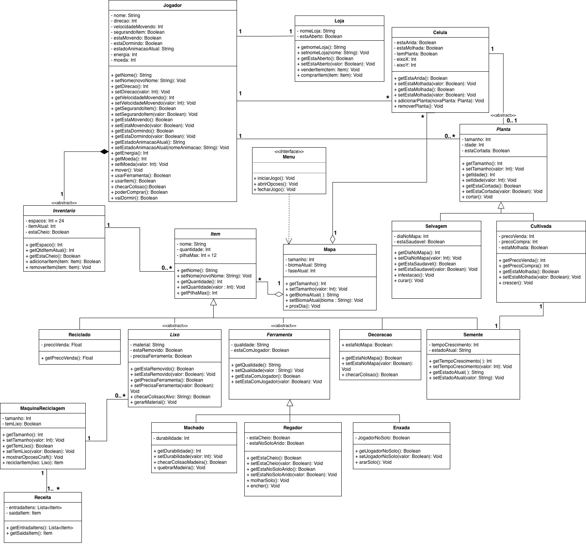

# 2.1. Módulo Notação UML – Modelagem Estática

## Introdução

Este artefato apresenta o Diagrama de Classes do projeto EcoGame, modelado segundo a notação UML. O diagrama foi construído a partir dos requisitos funcionais levantados durante o Design Sprint e priorizados com a técnica MoSCoW.

O Diagrama de Classes tem como objetivo representar a estrutura estática do sistema, sob a perspectiva de suas classes, identificando seus atributos, métodos e os relacionamentos entre elas, como associações, heranças e dependências.

## Metodologia

O diagrama foi elaborado separando separando todas as classes definidas na primeira etapa do grupo, e utiliza os seguintes elementos de notação UMl:

- **Classes**: Representadas por um retangulo separado em 3 partes onde no topo, se localiza seu nome, no meio seus atritubos e em baixo seus métodos. Elementos identificados como stereotype Abstract indicam classes que não podem ser instanciadas diretamente.
- **Herança**: Representada por uma seta com ponta triangular vazada. Indica que classes filhas herdam atributos e métodos de uma classe mãe, podendo estendê-los.
- **Associação com Agregação**: Representada por um losango vazado. Indica uma relação "todo-parte" onde as partes possuem ciclo de vida independente do objeto agregador.
- **Associação com Composição**: Representada por um losango preenchido. Indica uma relação de posse estrita, onde a existência das partes depende da existência do objeto principal.
- **Dependência**: Representada por uma seta tracejada com ponta aberta. Indica uma relação de fornecedor-cliente, onde uma alteração no elemento de destino pode impactar o funcionamento do elemento de origem.
- **Abstração**: Representada pelo stereotype Interface, define contratos de comportamento que classes de diferentes níveis de detalhe devem seguir.

## Diagrama de classes

Figura 1: Versão 1.0 - Estrutura Base (Heyttor Augusto)

.drawio.png)

Figura 2: Versão 2.0 - Refinamento, Especialização e Tradução (Yasmin Abdon)

As principais modificações foram:

Principais Modificações:

- Granularidade do Grid: Introdução da classe Celula para o controle individual dos estados do solo (RF11/RNF03). No diagrama, isso é representado pela relação de Agregação entre Mapa e Celula.

- Hierarquia de Itens: Especialização das classes Reciclado, Lixo, Ferramenta, Decoracao e Semente (RF29/30). Foi utilizada a relação de Herança (Generalização) para conectar estas subclasses à classe base Item.

- Subsistema de Craft: Implementação da lógica de processamento de materiais (RF06), utilizando uma relação de Associação simples entre as classes MaquinaReciclagem e Receita.

- Controle de Interface: Integração dos comandos de navegação e fluxo principal do jogo. Foi aplicada uma relação de Dependência (linha tracejada com ponta aberta) partindo de Menu em direção à classe Mapa.

- Encapsulamento e Regras de Negócio: Refinamento de Getters e Setters para proteger atributos críticos (como preços fixos de venda) e expor corretamente estados variáveis (como itens do inventário).

- Padronização Técnica: Localização integral do projeto para PT-BR e padronização da nomenclatura de métodos utilizando verbos no infinitivo (ex: venderItem, removerPlanta), garantindo maior clareza semântica.

## Referências

- BOOCH, Grady; RUMBAUGH, James; JACOBSON, Ivar. **UML: Guia do Usuário**. 2ª ed. Rio de Janeiro: Elsevier, 2005.
- PRESSMAN, Roger S.; MAXIM, Bruce R. **Engenharia de Software: Uma Abordagem Profissional**. 9ª ed. Porto Alegre: AMGH, 2021.
- Especificação de Requisitos e Priorização do projeto EcoGame.
- Lucidhart,O que é um diagrama de classe UML?,Lucidhart, Disponivel em:https://www.lucidchart.com/pages/pt/o-que-e-diagrama-de-classe-uml, acesso em: 17/04/2025
- UML DIAGRAMS. Class Diagrams Overview. [S. l.], 2024. Disponível em: https://www.uml-diagrams.org/class-diagrams-overview.html. Acesso em: 19 abr. 2026.