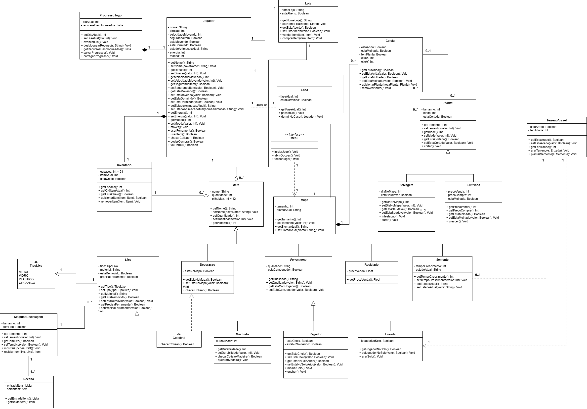
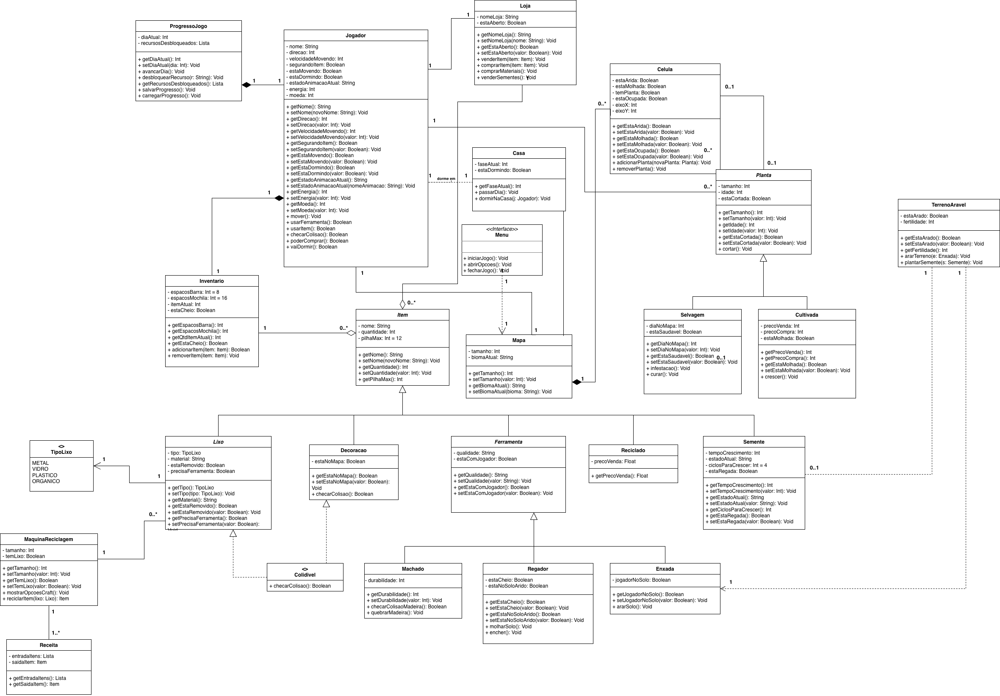
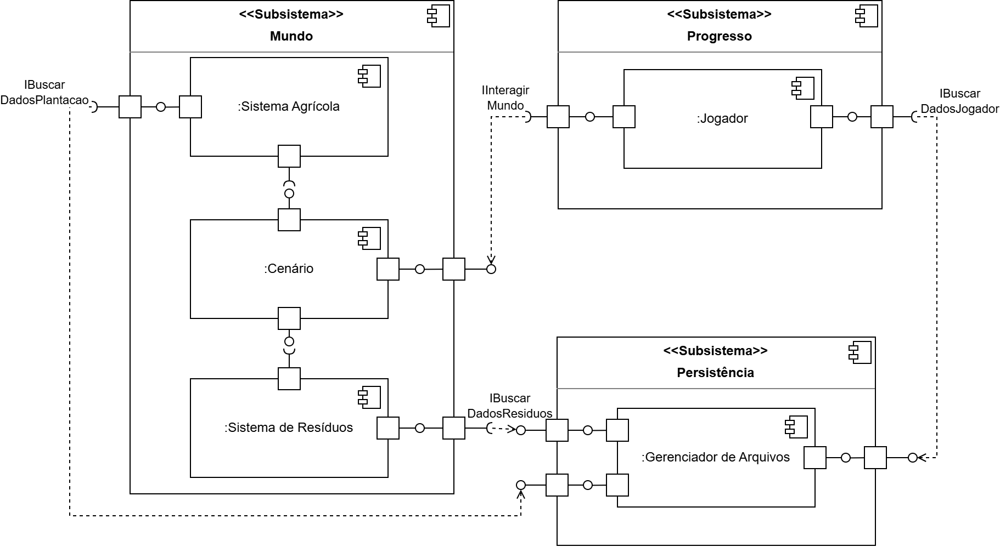

# 2.1. Módulo Notação UML – Modelagem Estática

## Introdução
Este artefato apresenta os Diagramas de Classes e Componentes do projeto **EcoGame**, modelados segundo a notação **UML**. O desenho de software foi fundamentado nos requisitos funcionais e não funcionais estabelecidos na **[Entrega 01](https://unbarqdsw2026-1-turma01.github.io/2026.1-T01_G1_FCTE_EcoGame_JogoSustentabilidade/desenho-de-software/base/iniciativas-extras/elicitacao/requisitos/)**, que foram elicitados via *Design Sprint* e priorizados através da técnica **MoSCoW**.

A modelagem foi desenvolvida de forma iterativa utilizando a ferramenta **draw.io**, buscando garantir a **rastreabilidade** entre as necessidades de negócio e a futura implementação técnica.

## Rastreabilidade & Elos com Outros Artefatos

Este módulo de modelagem estática consolida os requisitos detalhados na [Entrega 01](https://unbarqdsw2026-1-turma01.github.io/2026.1-T01_G1_FCTE_EcoGame_JogoSustentabilidade/desenho-de-software/base/iniciativas-extras/elicitacao/requisitos/). Cada versão dos diagramas abaixo foca em converter os Requisitos Funcionais (RFs) em estruturas lógicas, servindo de base para o desenvolvimento do código-fonte e para a validação dos Diagramas de Casos de Uso.

## Diagrama de classes

O Diagrama de Classes tem como objetivo representar a estrutura estática do sistema, sob a perspectiva de suas classes, identificando seus atributos, métodos e os relacionamentos entre elas, como associações, heranças e dependências.

### Metodologia

O diagrama foi elaborado separando separando todas as classes definidas na primeira etapa do grupo, e utiliza os seguintes elementos de notação UMl:

- **Classes**: Representadas por um retangulo separado em 3 partes onde no topo, se localiza seu nome, no meio seus atritubos e em baixo seus métodos. Elementos identificados como stereotype Abstract indicam classes que não podem ser instanciadas diretamente.
- **Herança**: Representada por uma seta com ponta triangular vazada. Indica que classes filhas herdam atributos e métodos de uma classe mãe, podendo estendê-los.
- **Associação com Agregação**: Representada por um losango vazado. Indica uma relação "todo-parte" onde as partes possuem ciclo de vida independente do objeto agregador.
- **Associação com Composição**: Representada por um losango preenchido. Indica uma relação de posse estrita, onde a existência das partes depende da existência do objeto principal.
- **Dependência**: Representada por uma seta tracejada com ponta aberta. Indica uma relação de fornecedor-cliente, onde uma alteração no elemento de destino pode impactar o funcionamento do elemento de origem.
- **Abstração**: Representada pelo stereotype Interface, define contratos de comportamento que classes de diferentes níveis de detalhe devem seguir.

### Diagramas

Figura 1: Versão 1.0 - Estrutura Base (Heyttor Augusto)

.drawio.png)

Figura 2: Versão 2.0 - Refinamento, Especialização e Tradução (Yasmin Abdon)

Esta etapa do projeto focou na transição de um modelo conceitual básico para um modelo de design mais próximo da implementação, priorizando a robustez e a manutenibilidade do código.

### Detalhamento das Modificações e Decisões de Design

#### **1. Granularidade do Grid e Gestão de Estados**
* **Modificação:** Introdução da classe `Celula`.
* **Rastreabilidade:** Atende diretamente ao **RF11** (Persistência do estado do solo) e **RNF03** (Desempenho/Modularidade).
* **Senso Crítico:** A decisão de utilizar uma relação de **Agregação** entre `Mapa` e `Celula` foi tomada para permitir que cada unidade do grid possua ciclo de vida e atributos próprios (como nível de hidratação ou tipo de solo), sem sobrecarregar a classe principal `Mapa`. Isso facilita futuras expansões, como diferentes biomas ou efeitos climáticos específicos por região.

#### **2. Arquitetura de Itens e Reaproveitamento de Código**
* **Modificação:** Especialização das classes (Reciclado, Lixo, Ferramenta, etc.).
* **Rastreabilidade:** Vinculado aos **RF29** e **RF30**.
* **Senso Crítico:** Optou-se pela **Generalização (Herança)** para conectar as subclasses à classe base `Item`. Essa abordagem garante o polimorfismo, permitindo que o sistema de inventário trate qualquer objeto de forma genérica, enquanto as classes filhas gerenciam comportamentos específicos. Isso reduz drasticamente a redundância de atributos comuns.

#### **3. Subsistema de Processamento (Crafting)**
* **Modificação:** Implementação da relação entre `MaquinaReciclagem` e `Receita`.
* **Rastreabilidade:** Atende ao **RF06**.
* **Senso Crítico:** Utilizou-se uma **Associação simples**, pois a lógica de "Receita" deve existir independentemente da máquina. Isso permite que diferentes máquinas utilizem o mesmo catálogo de receitas, promovendo o desacoplamento do sistema de craft.

#### **4. Fluxo de Navegação e Dependências**
* **Modificação:** Integração entre `Menu` e `Mapa`.
* **Senso Crítico:** Aplicou-se uma relação de **Dependência**. A escolha foi estratégica: o `Menu` precisa instanciar ou invocar métodos do `Mapa` em momentos específicos, mas não "possui" o mapa de forma fixa. Isso mantém a interface de usuário (UI) separada da lógica de jogo (Game Logic).

#### **5. Proteção de Dados e Integridade**
* **Modificação:** Refinamento de Encapsulamento (Getters/Setters).
* **Metodologia:** Aplicou-se o princípio do **Encapsulamento** para proteger regras de negócio sensíveis. Atributos de preço e constantes foram protegidos contra alterações externas acidentais, expondo apenas o que é estritamente necessário.

#### **6. Padronização e Localização**
* **Metodologia:** Foi adotada a localização integral para PT-BR e o padrão de nomenclatura *CamelCase* com verbos no infinitivo para métodos (ex: `venderItem`, `removerPlanta`). Essa padronização visa garantir a clareza semântica e facilitar a manutenção por outros desenvolvedores.

---

Figura 3: Versão 3 - Ajustes de Consistência e Completude (João Pedro)

Principais Modificações: 

- **Controle de Progresso**: Criação da classe `ProgressoJogo` com atributo `diaAtual` e métodos de avanço e salvamento. Relação de **Composição** com `Jogador`. Remoção do conceito de fase do `Mapa`.

- **Hierarquia de Lixo**: Unificação das subclasses em uma única classe `Lixo` com enum `TipoLixo` (`METAL`, `VIDRO`, `PLASTICO`, `ORGANICO`). Correção da herança de `Reciclado` para `Item`.

- **Interface `Colidivel`**: Extração do método `checarColisao()` para interface, implementada por `Lixo` e `Decoracao`. Elimina duplicação.

- **Cardinalidades Explícitas**: Adição de multiplicidades em todas as associações, com destaque para:
  - `Jogador` 1 ↔ 1 `Inventario` (composição)
  - `Mapa` 1 ↔ 0..* `Celula` (composição)
  - `Inventario` 1 ↔ 0..* `Item` (agregação)
  - `MaquinaReciclagem` 1 ↔ 1..* `Receita`

- **Ajustes de Relacionamento**: Relação `Mapa` ↔ `Celula` alterada de agregação para **composição** (diamante preenchido).

- **Encapsulamento e Nomenclatura**: Refinamento de getters/setters essenciais e padronização de métodos com verbos no infinitivo (`avancarDia`, `venderItem`, `removerPlanta`). 

Figura 4: Versão 4.0 - Detalhamento de Requisitos Funcionais (Gabriel Bevilaqua)

Principais Modificações:

- **Granularidade do Inventário (RF20)**: Substituição do atributo único `espacos: Int = 24` por `espacosBarra: Int = 8` e `espacosMochila: Int = 16`, refletindo a separação entre barra de atalho e mochila prevista no requisito funcional RF20 (inventário com barra e mochila). Getters atualizados para `getEspacosBarra()` e `getEspacosMochila()`.

- **Ciclo de Crescimento de Sementes (RF26/RF27)**: Adição dos atributos `ciclosParaCrescer: Int = 4` e `estaRegada: Boolean` na classe `Semente`, modelando o ciclo de rega e crescimento descrito nos requisitos RF26 (plantar sementes em terreno arado) e RF27 (regar plantas para crescimento). Getters e setters correspondentes adicionados.

- **Operações Comerciais da Loja (RF24)**: Adição dos métodos `comprarMateriais(): Void` e `venderSementes(): Void` à classe `Loja`, detalhando as operações de compra e venda de materiais e sementes conforme RF24 (comprar e vender itens na loja).

- **Controle de Ocupação de Célula (RF10)**: Adição do atributo `estaOcupada: Boolean` à classe `Celula` com getters e setters, permitindo verificar se uma célula do mapa já possui um objeto posicionado, atendendo ao requisito RF10 (mapa dividido em grid de células).

Figura 5: Versão 5 Refinamento de Mecânicas de Coleta e Ciclo de Jogo (Carlos Henrique)

Principais Modificações:

- Rastreabilidade da Coleta (RF03): Implementação do método coletarItem(item: Item): Void na classe Jogador. Esta adição garante a conformidade com o requisito RF03, definindo explicitamente a responsabilidade do avatar em remover objetos do cenário e transferi-los para o subsistema de inventário.

- Gestão de Empilhamento (RF21): Adição do atributo - limiteStack: Int = 12 na classe Inventario. A modificação atende ao requisito RF21, estabelecendo o teto de acúmulo de unidades por slot, o que impacta diretamente na lógica de capacidade de armazenamento do jogador.

- Integração Casa-Progresso (RF28): Criação de uma relação de Dependência (seta tracejada com rótulo avancarDia) partindo da classe Casa em direção à classe ProgressoJogo. Esta modelagem atende ao requisito RF28, representando que a ação de entrar na casa invoca o método de passagem de tempo no gerenciador global do jogo, disparando o crescimento de plantas e o respawn de resíduos no mapa.

---

**Figura 6: Versão 6.0 — Otimização de Inventário, Estados de Plantas e Interatividade (Daniel Nunes Duarte)**

Principais Modificações:

- **Sistema de Slots no Inventário (RF20, RF21, RF22)**: Introdução da classe `SlotInventario` como intermediária entre `Inventario` e `Item`, com multiplicidade 0..24. Esta arquitetura reflete precisamente a exigência de exatos 24 espaços físicos (8 na barra + 16 na mochila). Cada slot gerencia individualmente a pilha de até 12 unidades (`limiteStack: Int = 12`), permitindo que o HUD exiba corretamente a quantidade em cada "quadrado" do inventário. A classe SlotInventario encapsula a lógica de ocupação, tornando o sistema mais modular e facilitando futuras expansões como diferentes tipos de armazenamento.

- **Enumeração de Estágios de Crescimento (RF26, RF27)**: Criação da Enumeração `EstagioCrescimento` contendo os 4 estados explícitos (`SEMENTE`, `BROTO`, `JOVEM`, `ADULTA`) vinculada à classe `Planta`. Esta abordagem formaliza a regra de negócio de que a planta deve passar por exatamente 4 ciclos para chegar à forma final com mudança de sprite. A tipagem forte do enum garante que transições de estado sejam válidas e rastreáveis durante a regação e crescimento, eliminando a ambiguidade de representações genéricas com valores inteiros.

- **Interface de Interatividade (RF03, RF04)**: Criação da `<<interface>> Interagivel` contendo o método `interagir(): Void`, implementada por todas as classes que o jogador pode interagir (Lixo, Decoracao, Semente, etc.). Esta padronização obriga que todos os objetos interagíveis do jogo exponham um contrato padrão de resposta a cliques e colisões do avatar, garantindo modularidade e consistência na mecânica de coleta e interação. A interface assegura que os requisitos RF03 (remover objeto do cenário) e RF04 (animar coleta) sejam implementados uniformemente.

- **Coordenadas Espaciais Explícitas (RF10, RF02, RNF03)**: Adição dos atributos `posicaoX: Int` e `posicaoY: Int` nas classes `Lixo` e `Decoracao`, permitindo o armazenamento preciso da localização no grid. Esta adição é fundamental para RF10 (posicionar objetos em células habilitadas), RF02 (exibir resíduos distribuídos no mapa) e RNF03 (grid-based). Sem as coordenadas explícitas, o sistema não possuiria referência matemática para renderizar e persistir a localização exata dos objetos no cenário durante salvamentos e carregamentos.

---

**Figura 6: Versão 6.0 — Detalhamento Técnico (Daniel Nunes Duarte)**

### Detalhamento das Alterações e Rastreabilidade Técnica (V7)

#### **1. Sistema de Slots no Inventário (SlotInventario)**

* **Modificação:** Introdução da classe `SlotInventario` como entidade intermediária entre `Inventario` e `Item`.
* **Estrutura:**
  - Classe `SlotInventario` com atributos: `indice: Int`, `itens: Item[0..12]`, `ocupacao: Int`
  - Métodos: `adicionarItem(item: Item): Boolean`, `removerItem(quantidade: Int): Boolean`, `estaVazio(): Boolean`, `estaLotado(): Boolean`
  - Relacionamento: `Inventario` 1 ↔ 0..24 `SlotInventario` (Composição)
  - Relacionamento: `SlotInventario` 1 ↔ 0..12 `Item` (Agregação)

* **Rastreabilidade:**
  - **RF20 (Tamanho do inventário):** A multiplicidade 0..24 representa exatamente os 24 espaços físicos (8 barra + 16 mochila). A classe `Inventario` mantém uma coleção de 24 slots, garantindo a restrição de capacidade máxima.
  - **RF21 (Acúmulo de itens):** Cada slot gerencia individualmente até 12 unidades (`Item[0..12]`), encapsulando a lógica de empilhamento e transferência entre slots.
  - **RF22 (Quantidade de itens):** O atributo `ocupacao: Int` em cada slot permite que a interface gráfica exiba a quantidade dentro do "quadrado correspondente" no HUD, sem necessidade de cálculos externos.

* **Senso Crítico:** A introdução do SlotInventario promove separação de responsabilidades, permitindo que a lógica de empilhamento fique isolada de operações gerais de inventário. Isso facilita testes unitários e evita que a classe `Inventario` fique sobrecarregada com detalhes de gerenciamento de ocupação.

#### **2. Enumeração de Estágios de Crescimento (EstagioCrescimento)**

* **Modificação:** Criação da Enumeração `EstagioCrescimento` com 4 valores: `SEMENTE`, `BROTO`, `JOVEM`, `ADULTA`.
* **Estrutura:**
  - Enum `EstagioCrescimento { SEMENTE, BROTO, JOVEM, ADULTA }`
  - Atributo em `Planta`: `estagio: EstagioCrescimento = SEMENTE`
  - Métodos em `Planta`: `avancarEstagio(): Void`, `obterEstagio(): EstagioCrescimento`, `precisaAgua(): Boolean`

* **Rastreabilidade:**
  - **RF26 (Regador - Acelerar crescimento):** O método `avancarEstagio()` é invocado sempre que a planta é regada, formalizando a dependência entre rega e progressão de estado.
  - **RF27 (Crescimento em 4 ciclos):** A enumeração com exatamente 4 valores força a sequência linear de transformação. A mudança de sprite é vinculada diretamente à transição de estado: `SEMENTE` → `BROTO` → `JOVEM` → `ADULTA`.
  - **Regra de Negócio Explícita:** A tipagem forte do enum impede estados inválidos (como "estagio = 5"), garantindo integridade da modelagem de crescimento.

* **Senso Crítico:** Usar uma enumeração em vez de um simples `Int idade` torna a regra de negócio auto-evidente no código. Qualquer desenvolvedor que consulte a classe `Planta` verá imediatamente os 4 ciclos definidos, reduzindo documentação implícita e diminuindo bugs de estado inválido.

#### **3. Interface de Interatividade (Interagivel)**

* **Modificação:** Criação da `<<interface>> Interagivel` com método padrão `interagir(): Void`.
* **Estrutura:**
  - Interface `Interagivel { interagir(): Void }`
  - Implementada por: `Lixo`, `Decoracao`, `Semente`, `Ferramenta`, `Casa`
  - Cada classe concreta define seu próprio comportamento de interação

* **Rastreabilidade:**
  - **RF03 (Coletar itens):** Quando o jogador clica em um `Lixo`, o método `interagir()` de `Lixo` é invocado, que por sua vez remove o objeto do cenário e o transfere para o inventário via `coletarItem()`.
  - **RF04 (Animar coleta on click):** A interface obriga que toda classe interagível implemente `interagir()`, incluindo a lógica de acionamento de animação. Isso garante que não haja objetos interagíveis sem animação de resposta.
  - **Padrão Strategy:** A interface estabelece um contrato que permite ao avatar chamar `objeto.interagir()` polimorficamente, sem conhecer o tipo específico do objeto.

* **Senso Crítico:** A interface elimina a necessidade de casting ou verificações de tipo (`instanceof`). O código do avatar fica genérico: "se é `Interagivel`, então pode chamar `interagir()`", promovendo extensibilidade futura sem modificações no núcleo do sistema de interação.

#### **4. Coordenadas Espaciais (posicaoX e posicaoY)**

* **Modificação:** Adição dos atributos `posicaoX: Int` e `posicaoY: Int` nas classes `Lixo` e `Decoracao`.
* **Estrutura:**
  - Classe `Lixo`: novo atributo `- posicaoX: Int`, `- posicaoY: Int`
  - Classe `Decoracao`: novo atributo `- posicaoX: Int`, `- posicaoY: Int`
  - Métodos adicionados: `obterPosicao(): (Int, Int)`, `alterarPosicao(x: Int, y: Int): Void`, `estaEm(x: Int, y: Int): Boolean`

* **Rastreabilidade:**
  - **RF10 (Posicionar objetos no mapa):** Os atributos de posição armazenam as coordenadas exatas da célula onde cada decoração está posicionada. O sistema de verificação de células habilitadas usa essas coordenadas para validar se a posição está disponível antes de permitir o posicionamento.
  - **RF02 (Exibir resíduos distribuídos):** Para renderizar lixo espalhado pelo mapa, o engine precisa da localização (X, Y) de cada objeto. Sem os atributos de posição, o sistema não saberia onde desenhar cada `Lixo`.
  - **RNF03 (Grid-based):** A base do jogo ser em "células quadradas" exige que todos os objetos fixos no mapa tenham referência matemática de sua posição. Cada célula é referenciada por (X, Y), e armazená-los explicitamente facilita persistence (salvamentos) e queries de colisão.

* **Senso Crítico:** As coordenadas explícitas permitem que o sistema salve o estado exato do mapa (quais decorações onde) sem necessidade de recalcular posições. Isso também facilita o sistema de colisão: verificar se o avatar colidiu com um objeto em `(posicaoX, posicaoY)` é trivial comparado a percorrer toda a estrutura do mapa.

---

## Diagrama de Componentes

O diagrama de componentes tem como objetivo apresentar uma visão geral dos sistemas e subsistemas que compõe o produto de software, 
demonstrando como os módulos se comunicam entre si e quais módulos apresentam dependência ou funcionalidades específicas, 
permitindo posterior identificação de oportunidades de reuso.

### Metodologia

A seção de metodologia apresenta e identifica os objetos dos diagramas de componente. O diagrama de componentes utiliza a seguinte notação UML:

- **Subsistema**            : Logo abaixo do sistema completo, o subsistema é um conjunto de componentes e é identificado por um retângulo com um livro, tal como os componentes. Pode ou não depender de outro subsistema para realizar uma funcionalidade completa. A funcionalidade implementada pelo subsistema pode ser observada a partir dos componentes que engloba. O subsistema define quais componentes possuem interfaces providas e/ou requeridas.
- **Componente**            : O componente, indicado por um retângulo com um ícone de um livro, é um conjunto de funcionalidades idealmente modulares. Para fins de visualização e simplicidade de modelagem do software, será a menor granularidade atingida. Componentes são visualmente menores que subsistemas e estão *dentro* de subsistemas. As funcionalidades implementadas pelo componente são identificadas pelo seu nome e seu papel no subsistema pode ser identificado por meio de suas interfaces com demais componentes.
- **Portas**                : Portas, representadas por um quadrado, definem comunicação chegando ou saindo de partes do software e precisam ser combinadas com interfaces para compreensão.
- **Interfaces Providas**   : Interfaces Providas são representadas por meio de círculos, ligadas aos quadrados, as portas. Interfaces providas são por onde a comunicação é providenciada, ou seja, disponibilizada pelo componente.  
- **Interfaces Requeridas** : Interfaces requeridas são indicadas por um semicírculo e demonstram que o determinado componente ou subsistema necessita daquele pedaço de comunicação para funcionar corretamente.

## Diagramas

A seção de Diagramas visa conter os diagrams elaborados pela equipe.

**Figura 7: Diagrama de Componentes Versão 1 - Matheus Henrick**

## Observações Gerais

- A referência de BELL (2011) está arquivada no archive.org e é passível de não ser acessível caso os servidores estejam fora do ar.

## Referências

- BOOCH, Grady; RUMBAUGH, James; JACOBSON, Ivar. **UML: Guia do Usuário**. 2ª ed. Rio de Janeiro: Elsevier, 2005.
- PRESSMAN, Roger S.; MAXIM, Bruce R. **Engenharia de Software: Uma Abordagem Profissional**. 9ª ed. Porto Alegre: AMGH, 2021.
- Especificação de Requisitos e Priorização do projeto EcoGame.
- Lucidhart,O que é um diagrama de classe UML?,Lucidhart, Disponivel em:https://www.lucidchart.com/pages/pt/o-que-e-diagrama-de-classe-uml, acesso em: 17/04/2025
- UML DIAGRAMS. Class Diagrams Overview. [S. l.], 2024. Disponível em: https://www.uml-diagrams.org/class-diagrams-overview.html. Acesso em: 19 abr. 2026.
- BELL, Donald. UML basics: The component diagram. 2011. Disponível em: https://web.archive.org/web/20111219131420/https://www.ibm.com/developerworks/rational/library/dec04/bell/index.html. Acesso em: 24 abr. 2026. 
