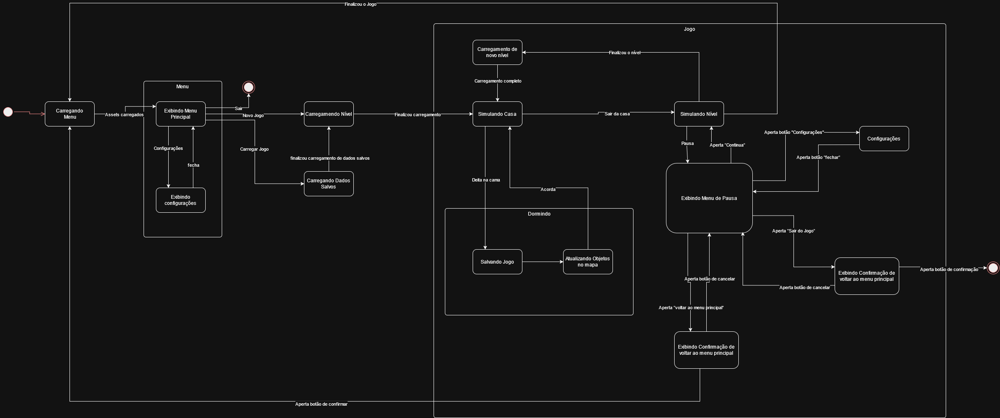
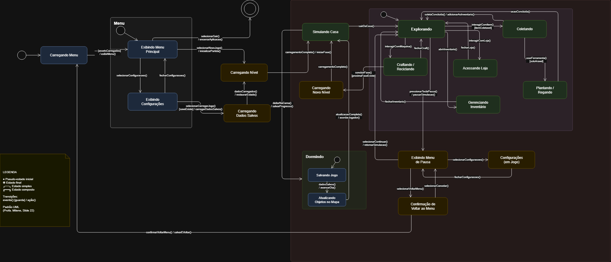
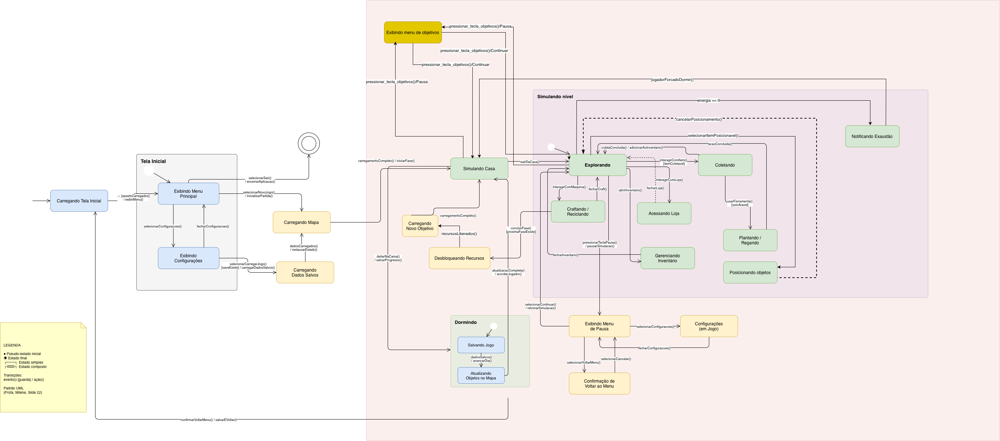
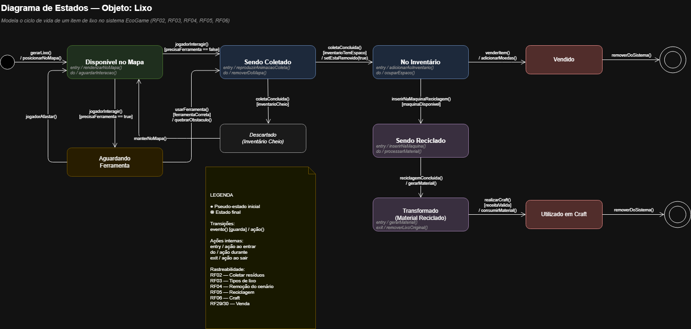
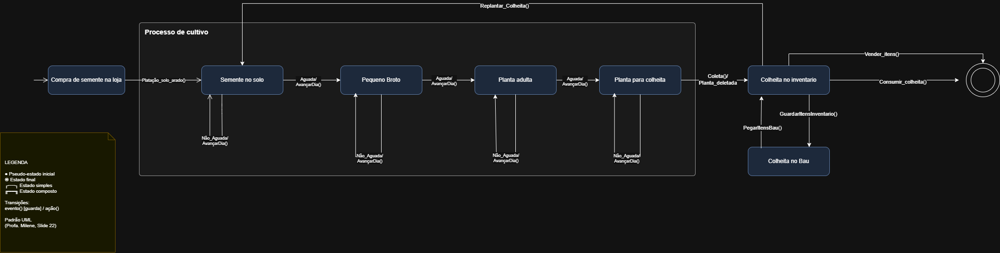
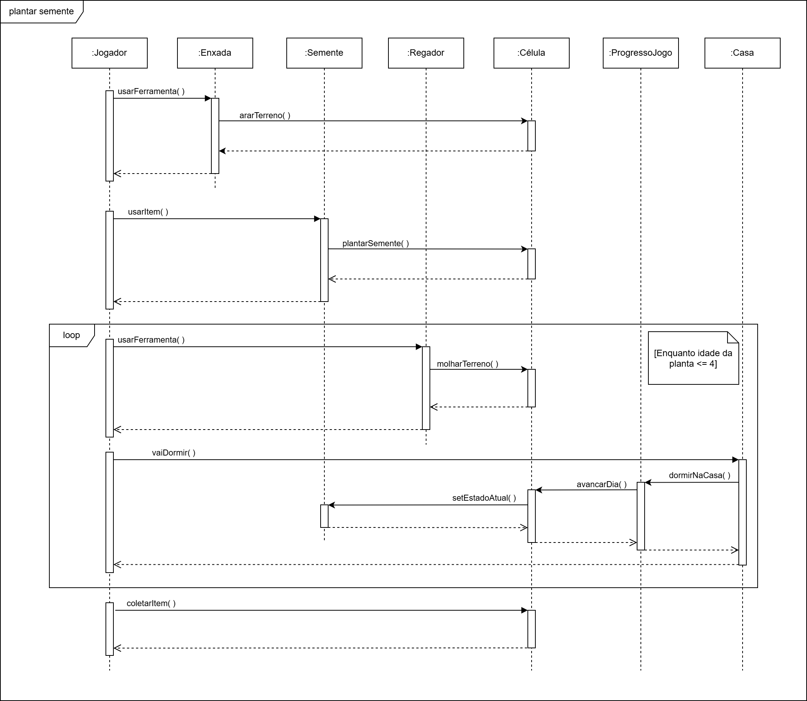

# 2.2. Módulo Notação UML – Modelagem Dinâmica

## Introdução

Este artefato apresenta os Diagramas de Estados do projeto EcoGame, modelados segundo a notação UML 2.4. Os diagramas capturam o comportamento dinâmico do sistema, especificando os estados pelos quais os elementos do jogo transitam ao longo da execução — desde o carregamento inicial até o gameplay e suas interações — e como esses estados respondem a eventos e condições do ambiente.

A modelagem foi desenvolvida de forma iterativa e colaborativa, com múltiplas versões produzidas pelos membros da equipe, evoluindo de uma visão macro do fluxo de jogo até diagramas comportamentais detalhados de classes específicas.

## Metodologia

Os diagramas foram elaborados com base nos requisitos funcionais RF01–RF30, utilizando a notação UML para máquinas de estados, com os seguintes elementos:

| Elemento | Notação | Descrição |
|----------|---------|-----------|
| Estado simples | Retângulo arredondado | Condição estável do sistema ou objeto |
| Estado composto | Retângulo arredondado com subestados internos | Agrupa subestados que compartilham contexto |
| Pseudo-estado inicial | ● (círculo preenchido) | Marca o ponto de entrada de uma máquina de estados |
| Estado final | ◉ (círculo com borda) | Marca o encerramento do ciclo de vida |
| Transição | Seta rotulada | Formato: `evento() [guarda] / ação()` |
| Atividade interna | Compartimento dentro do estado | Ações de `entry`, `do` e `exit` |
| Pseudo-estado de junção | ◆ | Combina múltiplos fluxos de retorno (Junction) |

Todos os diagramas foram elaborados na ferramenta [draw.io](https://app.diagrams.net/) e os arquivos-fonte `.drawio` estão disponíveis na pasta `docs/imagens/`.

---

## Diagrama de Estados – Visão Geral do Sistema

Esta seção apresenta a evolução do diagrama de estados que modela o fluxo principal do jogo, abrangendo desde a inicialização da aplicação até os ciclos de gameplay.

---

### Versão 1 – Estrutura Base

A primeira versão cobre o fluxo macro de gameplay, estabelecendo os estados principais e as transições entre eles.

    
<strong>Figura 1 – Diagrama Geral de Estados V1</strong>

    
Autor: <a href="#">Ryan</a>

---

### Versão 2 – Refinamento e Decomposição de Estados

A segunda versão aprofunda o detalhamento do fluxo de gameplay e das interações com os menus, introduzindo estados compostos e padronizando as transições no formato UML.

    
<strong>Figura 2 – Diagrama Geral de Estados V2</strong>

    
Autor: <a href="#">João Pedro</a>

**Principais Modificações em relação à V1:**

- **Correção Ortográfica**: O estado `Carregamendo Nível` foi renomeado para `Carregando Nível`.

- **Decomposição do Estado "Simulando Nível" (Monolítico → Composto)**: O estado antes monolítico `Simulando Nível` foi substituído por um estado composto contendo os subestados: `Explorando`, `Coletando`, `Craftando / Reciclando`, `Acessando Loja`, `Plantando / Regando` e `Gerenciando Inventário`, refletindo a granularidade real do gameplay (RF01–RF04, RF06, RF09–RF11).

- **Adição de Pseudo-estados Iniciais**: Dentro de `Simulando Nível` foi incluído o pseudo-estado inicial (●) apontando para `Explorando`. Dentro de `Dormindo`, o pseudo-estado inicial foi conectado a `Salvando Jogo`, garantindo a correta iniciação do fluxo de descanso.

- **Padronização das Transições no Formato UML**: Todas as transições foram reescritas no formato `evento() [guarda] / ação()`. Exemplos:
  - Antes: `"Assets carregados"` → Depois: `— [assetsCarregados] / exibirMenu()`
  - Antes: `"Aperta botão de confirmação"` → Depois: `confirmarVoltarMenu() / salvarEVoltar()`
  - Antes: `"Pausa"` → Depois: `pressionarTeclaPausa() / pausarSimulacao()`

- **Reorganização Hierárquica dos Estados**:
  - Os estados `Exibindo Menu Principal` e `Exibindo Configurações` foram agrupados em um estado composto `Menu`.
  - O estado `Jogo` passou a ser um container visual envolvendo `Simulando Casa`, `Carregando Nível`, `Carregando Dados Salvos`, o composto `Simulando Nível` e o composto `Dormindo`.
  - Estados de confirmação e configurações foram claramente associados ao menu de pausa.

- **Padronização da Nomenclatura**: Acentuação e capitalização corrigidas (ex: `Exibindo configurações` → `Exibindo Configurações`).

- **Inclusão de Legenda UML**: Nota explicativa com os símbolos usados e a sintaxe das transições, conforme padronização da disciplina.

A quarta versão, feita pelo aluno José Oliveira, incorporou todas as mudanças da v3 e adicionou dois novos estados para cobrir requisitos funcionais identificados como ausentes no diagrama, conforme a imagem abaixo:

**Imagem 5 - Diagrama Geral V4**

**Autor - José Oliveira**

  Principais Modificações

- **Adição do estado `Notificando Exaustão` (RF13 / UC05)**:  
  As versões anteriores não modelavam o comportamento do sistema quando a energia do jogador chega a zero durante o gameplay. Foi adicionado o estado `Notificando Exaustão`, com transição de entrada disparada pela guarda `[energia == 0]` a partir de `Explorando`, e transição de saída com ação `jogadorForcadoDormir()` levando o jogador de volta a `Simulando Casa`. Sem esse estado, o diagrama deixava em aberto o fluxo de exaustão, que afeta diretamente a mecânica de progressão do jogo (RF07, RF08).

- **Adição do estado `Desbloqueando Recursos` (RF08 / UC15)**:  
  As versões anteriores possuíam uma transição direta de `concluirFase()` para `Carregando Novo Objetivo`, ignorando o requisito RF08 (Desbloquear Recursos — **Must**), que determina que o sistema deve desbloquear novos itens, receitas e áreas ao término de cada fase. O novo estado `Desbloqueando Recursos` foi inserido como intermediário, com entrada via `concluirFase() [proximaFaseExiste]` e saída via `recursosLiberados()`, tornando explícito esse passo funcional obrigatório antes do carregamento do próximo objetivo.

## Diagrama de plantações

### Versão 3 – Adaptação à Semântica do Jogo

A terceira versão adapta a terminologia aos conceitos específicos do EcoGame (substituindo "níveis/fases" por "mapa/objetivos") e acrescenta interações com o menu de objetivos.

    
<strong>Figura 3 – Diagrama Geral de Estados V3</strong>

    
Autor: <a href="#">Heyttor Augusto</a>

**Principais Modificações em relação à V2:**

- **Adaptação de Terminologia**: Termos como "nível" e "fase" foram substituídos por "mapa" e "objetivo", alinhando o modelo à proposta narrativa do jogo.
- **Adição do Menu de Objetivos**: Novo estado e transições para acesso e saída do painel de objetivos durante o gameplay.

---

## 2.2.1. Modelagem Comportamental de Classes (Refinamento Técnico)

Diferente das visões macro do sistema apresentadas anteriormente, esta seção foca na Máquina de Estados Comportamental de classes e entidades específicas do jogo (conforme a especificação UML 2.4), garantindo rastreabilidade total com os métodos e atributos do Diagrama de Classes.

---

### Diagrama de Estados: Classe `Jogador`

Este diagrama modela o ciclo de vida dinâmico da entidade `Jogador`, especificando como o objeto reage a eventos de gameplay e gerencia seus estados internos (energia e moedas).

    
<strong>Figura 4 – Máquina de Estados: Classe Jogador</strong>

    
Autor: <a href="#">Yasmin Abdon</a>

**Diferenciais desta Modelagem:**

- **Consistência Técnica**: Todas as transições são disparadas por gatilhos que correspondem a métodos reais da classe, como `mover()`, `poderComprar()` e `vaiDormir()`.

- **Pseudo-estado de Junção (Junction)**: Implementado para otimizar o fluxo de retorno ao estado `Ocioso`, evitando redundância de setas e poluição visual.

- **Atividades Internas**: Uso de compartimentos `entry`, `do` e `exit` para modelar efeitos colaterais como reset de energia e progressão de fase via `mapa.proxDia()`.

- **Guardas Lógicas**: Expressões booleanas baseadas em atributos de classe, como `[energia > 0]` e `[moeda > 0]`.

---

### Diagrama de Estados: Item `Lixo`

Este diagrama modela o ciclo de vida dos itens de lixo presentes no mapa do jogo, desde sua aparição no cenário até as possíveis destinações: venda direta, reciclagem ou uso em craft (RF02–RF06, RF29–RF30).

    
<strong>Figura 5 – Diagrama de Estados: Item Lixo</strong>

    
Autor: <a href="#">João Pedro</a>

**Diferenciais desta Modelagem:**

- **Múltiplos Caminhos de Destino**: O diagrama explicita os três destinos possíveis para um item de lixo — venda direta (`Vendido`), reciclagem (`Sendo Reciclado` → `Transformado`) e uso em craft (`Utilizado em Craft`) — todos convergindo para `removerDoSistema()`, refletindo o ciclo completo de RF02–RF06 e RF29–RF30.

- **Guarda de Ferramenta**: A transição de `Disponível no Mapa` inclui a guarda `[precisaFerramenta]`, separando itens coletáveis diretamente daqueles que exigem uma ferramenta específica (`usarFerramenta() [ferramentaCorreta] / quebrarObstaculo()`), com estado intermediário `Aguardando Ferramenta`.

- **Atividades Internas Detalhadas**: Uso de compartimentos `entry` e `do` nos estados — por exemplo, `Disponível no Mapa` executa `entry / renderizarNoMapa()` e `do / aguardarInteracao()`; `Sendo Coletado` executa `entry / reproduzirAnimacaoColeta()` e `do / removerDoMapa()` — tornando os efeitos colaterais explícitos.

- **Estado de Descarte por Inventário Cheio**: Quando o inventário está cheio (`[inventarioCheio]`), o lixo transita para o estado `Descartado (Inventário Cheio)` em vez de ser coletado, modelando a restrição de capacidade (RF20–RF22).

- **Rastreabilidade de Requisitos**: RF02 (coletar resíduos), RF03 (tipos de lixo), RF04 (remoção do cenário), RF05 (reciclagem), RF06 (craft) e RF29–RF30 (venda) são todos cobertos por estados e transições nomeados explicitamente no diagrama.

---

### Diagrama de Estados: Entidade `Plantação`

Este diagrama modela o ciclo de vida dos itens cultiváveis do jogo, desde o plantio até a colheita ou morte da planta, refletindo os ciclos de crescimento definidos nos requisitos de agricultura (RF11, RF25–RF27).

    
<strong>Figura 6 – Diagrama de Estados: Entidade Plantação</strong>

    
Autor: <a href="#">Heyttor Augusto</a>

**Diferenciais desta Modelagem:**

- **Progressão Linear com Guarda de Rega**: O diagrama modela quatro estágios de crescimento (`Semente no Solo` → `Pequeno Broto` → `Planta Adulta` → `Planta para Colheita`) agrupados em um estado composto `Processo de Cultivo`. Cada avanço é disparado por `Aguada/ AvancarDia()`, enquanto a ausência de rega (`Não_Aguada/ AvancarDia()`) mantém o estágio atual — implementando diretamente RF26–RF27.

- **Estado Composto de Cultivo**: O agrupamento dos quatro estágios de crescimento em um único estado composto permite representar que qualquer evento de abandono (ex: morte por seca prolongada) pode encerrar o ciclo de dentro do composto, sem repetir essa transição em cada subestado individualmente.

- **Múltiplos Destinos Pós-Colheita**: Após `Coleta() / Planta_deletada`, a colheita pode ir para `Colheita no Inventário` ou `Colheita no Baú` (via `PegarItensBau()` / `GuardarItensInventario()`), e de lá ser `Vender_Itens()` ou `Consumir_Colheita()`, cobrindo RF11 e RF29–RF30.

- **Ciclo de Replantio**: A transição `Replantar_Colheita()` retorna diretamente de `Colheita no Inventário` para `Semente no Solo`, modelando o loop de agricultura sustentável central à proposta do EcoGame (RF11, RF25).

---

## Descrição dos Estados

A tabela a seguir descreve os estados modelados no diagrama de visão geral do sistema (V3).

| Estado | Tipo | Descrição | Requisitos Relacionados |
|--------|------|-----------|------------------------|
| Carregando Menu | Simples | O sistema carrega os assets iniciais da aplicação (sprites, sons, fontes). | RF12 |
| Exibindo Menu Principal | Simples | O jogador visualiza as opções da tela inicial: Iniciar, Carregar, Configurações e Sair. | RF12 |
| Exibindo Configurações | Simples | O jogador acessa e modifica configurações de áudio, vídeo e controles. | RF14 |
| Carregando Dados Salvos | Simples | O sistema lê o arquivo de save e restaura o estado da partida anterior. | RF07 |
| Simulando Casa | Simples | O avatar está no interior da casa do jogador, podendo interagir com o ambiente doméstico. | RF28 |
| Carregando Mapa | Simples | O sistema realiza a transição entre áreas, carregando os assets do mapa destino. | RF17 |
| Menu (Composto) | Composto | Agrupa os estados relacionados à navegação de menus: `Exibindo Menu Principal` e `Exibindo Configurações`. | RF12 |
| Jogo (Composto) | Composto | Container que envolve todos os estados ativos de uma sessão de jogo. | RF01–RF30 |
| Simulando Mapa (Composto) | Composto | Estado ativo durante o gameplay no mapa externo. Contém os subestados de interação. | RF01–RF11 |
| Explorando | Simples (sub) | O avatar se movimenta livremente pelo mapa. | RF01 |
| Coletando | Simples (sub) | O avatar coleta resíduos ou itens do cenário. | RF02, RF03, RF04 |
| Craftando / Reciclando | Simples (sub) | O jogador utiliza a bancada de craft ou a maquininha de reciclagem. | RF05, RF06 |
| Acessando Loja | Simples (sub) | O jogador interage com o NPC de comércio para comprar ou vender itens. | RF23, RF24, RF29, RF30 |
| Plantando / Regando | Simples (sub) | O jogador realiza ações de agricultura: arar, plantar ou regar. | RF11, RF25, RF26, RF27 |
| Gerenciando Inventário | Simples (sub) | O jogador organiza, equipa ou descarta itens do inventário. | RF20, RF21, RF22 |
| Acessando Objetivos | Simples (sub) | O jogador consulta o painel de objetivos e missões ativas. | RF07, RF08 |
| Menu de Pausa (Composto) | Composto | Suspende o gameplay e oferece opções de retomada, configurações ou saída. | — |
| Dormindo (Composto) | Composto | Representa o ciclo de descanso: salva o jogo e avança para o próximo dia. | RF28 |
| Salvando Jogo | Simples (sub) | O sistema persiste o estado atual da partida no arquivo de save. | RF07 |
| Avançando Dia | Simples (sub) | O sistema processa os efeitos do tempo: crescimento de plantas, reposição de lixo. | RF26, RF27 |

---

## Tabela de Transições

A tabela a seguir descreve as principais transições do diagrama de visão geral (V3), no formato UML `evento() [guarda] / ação()`.

| # | Origem | Destino | Evento | Guarda | Ação |
|---|--------|---------|--------|--------|------|
| 1 | [inicial] | Carregando Menu | `iniciarAplicacao()` | — | `carregarAssets()` |
| 2 | Carregando Menu | Exibindo Menu Principal | — | `[assetsCarregados]` | `exibirMenu()` |
| 3 | Exibindo Menu Principal | Carregando Dados Salvos | `selecionarContinuar()` | `[saveExistente]` | `lerArquivoSave()` |
| 4 | Exibindo Menu Principal | Simulando Casa | `selecionarNovoJogo()` | `[!saveExistente]` | `inicializarNovaPartida()` |
| 5 | Carregando Dados Salvos | Simulando Casa | — | `[dadosCarregados]` | `restaurarEstado()` |
| 6 | Exibindo Menu Principal | Exibindo Configurações | `abrirConfiguracoes()` | — | `exibirPainelConfig()` |
| 7 | Exibindo Configurações | Exibindo Menu Principal | `fecharConfiguracoes()` | — | `salvarConfig()` |
| 8 | Simulando Casa | Carregando Mapa | `sairDaCasa()` | — | `carregarMapaExterno()` |
| 9 | Carregando Mapa | Explorando | — | `[mapaCarregado]` | `posicionarAvatar()` |
| 10 | Explorando | Coletando | `interagirComItem()` | `[itemAcessivel]` | `iniciarAnimacaoColeta()` |
| 11 | Coletando | Explorando | — | `[coletaConcluida]` | `adicionarAoInventario()` |
| 12 | Explorando | Craftando / Reciclando | `interagirComBancada()` | `[bancadaAcessivel]` | `abrirInterfaceCraft()` |
| 13 | Craftando / Reciclando | Explorando | `fecharCraft()` | — | `fecharInterfaceCraft()` |
| 14 | Explorando | Acessando Loja | `interagirComLojista()` | `[lojistaAcessivel]` | `abrirInterfaceLoja()` |
| 15 | Acessando Loja | Explorando | `fecharLoja()` | — | `fecharInterfaceLoja()` |
| 16 | Explorando | Plantando / Regando | `usarFerramenta()` | `[terrenoAcessivel]` | `iniciarAcaoAgricola()` |
| 17 | Plantando / Regando | Explorando | — | `[acaoConcluida]` | `atualizarTerreno()` |
| 18 | Explorando | Gerenciando Inventário | `abrirInventario()` | — | `exibirInventario()` |
| 19 | Gerenciando Inventário | Explorando | `fecharInventario()` | — | `fecharInventario()` |
| 20 | Explorando | Acessando Objetivos | `abrirObjetivos()` | — | `exibirPainelObjetivos()` |
| 21 | Acessando Objetivos | Explorando | `fecharObjetivos()` | — | `fecharPainelObjetivos()` |
| 22 | Simulando Mapa | Menu de Pausa | `pressionarTeclaPausa()` | — | `pausarSimulacao()` |
| 23 | Menu de Pausa | Simulando Mapa | `retomar()` | — | `retomarSimulacao()` |
| 24 | Menu de Pausa | Exibindo Menu Principal | `confirmarVoltarMenu()` | — | `salvarEVoltar()` |
| 25 | Simulando Casa | Dormindo | `dormir()` | `[energiaBaixa ou jogadorNaCasa]` | `iniciarCicloDescanso()` |
| 26 | Dormindo | Salvando Jogo | [inicial do composto] | — | `salvarEstado()` |
| 27 | Salvando Jogo | Avançando Dia | — | `[jogoSalvo]` | `processarNovoDia()` |
| 28 | Avançando Dia | Simulando Casa | — | `[diaProcessado]` | `restaurarEnergia()` |
| 29 | Exibindo Menu Principal | [final] | `selecionarSair()` | — | `encerrarAplicacao()` |

---

## Rastreabilidade com Requisitos Funcionais

| Requisito | Descrição Resumida | Estados/Transições Relacionados |
|-----------|-------------------|---------------------------------|
| RF01 | Movimentação do avatar | `Explorando` |
| RF02 | Coleta de resíduos no mapa | `Coletando` (transições 10–11) |
| RF03 | Remoção de itens do cenário | `Coletando` → `adicionarAoInventario()` |
| RF04 | Adição de itens ao inventário | Transição 11 |
| RF05 | Reciclagem de itens | `Craftando / Reciclando` |
| RF06 | Sistema de craft | `Craftando / Reciclando` (transições 12–13) |
| RF07 | Gerenciamento de progresso/save | `Carregando Dados Salvos`, `Salvando Jogo` |
| RF08 | Desbloqueio de recursos | `Acessando Objetivos` |
| RF09 | Ferramentas com animação | `Plantando / Regando` (transição 16) |
| RF10 | Posicionamento de objetos no mapa | `Explorando` |
| RF11 | Sistema de agricultura | `Plantando / Regando` |
| RF12 | Tela inicial / iniciar jogo | `Carregando Menu`, `Exibindo Menu Principal` (transições 1–4) |
| RF14 | Música por cenário | `Exibindo Configurações` |
| RF17 | Múltiplos mapas | `Carregando Mapa` (transição 8–9) |
| RF20–RF22 | Gerenciamento de inventário | `Gerenciando Inventário` (transições 18–19) |
| RF23–RF24 | Compra de itens na loja | `Acessando Loja` (transições 14–15) |
| RF25 | Plantio de sementes | `Plantando / Regando` |
| RF26–RF27 | Rega e crescimento de plantas | `Avançando Dia`, `Plantando / Regando` |
| RF28 | Dormir / avançar dia | `Dormindo`, `Avançando Dia` (transições 25–28) |
| RF29–RF30 | Venda de itens na loja | `Acessando Loja` |

---

# Diagrama de Sequência

  
<strong>Figura 8 – Versão 1 do Diagrama de Sequência de Plantações do EcoGame</strong>

  

  
Autor: <a href="https://github.com/MatheusHenrickSantos">Matheus Henrick</a>.

---

## Referências

- BOOCH, Grady; RUMBAUGH, James; JACOBSON, Ivar. **UML: Guia do Usuário**. 2ª ed. Rio de Janeiro: Elsevier, 2005.
- PRESSMAN, Roger S.; MAXIM, Bruce R. **Engenharia de Software: Uma Abordagem Profissional**. 9ª ed. Porto Alegre: AMGH, 2021.
- UML State Machine Diagrams. Disponível em: [https://www.uml-diagrams.org/state-machine-diagrams.html](https://www.uml-diagrams.org/state-machine-diagrams.html). Acesso em: 21 abr. 2026.
- Especificação de Requisitos e Priorização do projeto EcoGame.
- **UML DIAGRAMS**. Sequence Diagrams. Disponível em: https://www.uml-diagrams.org/sequence-diagrams.html. Acesso em: 24 abr. 2026.
