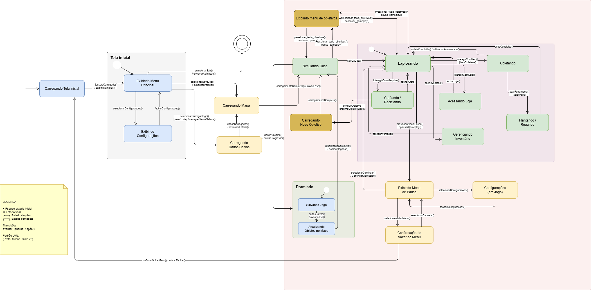

# 2.2. Módulo Notação UML – Modelagem Dinâmica

## Introdução
Este artefato apresenta o Diagrama de Estados do projeto EcoGame,
modelado segundo a notação UML. O diagrama modela os estados pelos
quais o sistema passa ao longo da execução, desde o carregamento
inicial até o gameplay e suas interações.

## Metodologia
O diagrama foi elaborado com base nos requisitos funcionais RF01-RF30,
utilizando a notação UML para máquinas de estados, com:
- Estados simples (retângulos arredondados)
- Estados compostos (com subestados internos)
- Pseudo-estado inicial (●) e estado final (◉)
- Transições no formato: evento [guarda] / ação

## Diagrama de Estados

## Diagrama de visão geral

A primeira versão do diagrama que planeja cobrir todo o fluxo de gameplay foi feita pelo aluno Ryan conforme a imagem abaixo:

**Imagem 1 - Diagrama Geral V1**

**Autor - Ryan**

A segunda versão adicionando detalhamento no fluxo de gameplay e interação com os menus foi feita pelo aluno João Pedro conforme a imagem abaixo:

**Imagem 2 - Diagrama Geral V2**

**Autor - João Pedro**

  Principais Modificações

- **Correção de Erro de Digitação**: O estado `Carregamendo Nível` foi renomeado para `Carregando Nível`, alinhando‑se à grafia correta em português.

- **Decomposição do Estado “Simulando Nível” (Monolítico → Composto)**:  
  O estado antes monolítico `Simulando Nível` foi substituído por um **estado composto** que contém os subestados internos:  
  `Explorando`, `Coletando`, `Craftando / Reciclando`, `Acessando Loja`, `Plantando / Regando` e `Gerenciando Inventário`.  
  Isso reflete a granularidade real do gameplay (RF01–RF04, RF06, RF09–RF11).

- **Adição de Pseudo‑estados Iniciais**:  
  - Dentro do novo estado composto `Simulando Nível` foi incluído o pseudo‑estado inicial (●) que aponta para o subestado `Explorando`.  
  - Dentro do estado composto `Dormindo` também foi adicionado o pseudo‑estado inicial, conectado a `Salvando Jogo`, garantindo a correta iniciação do fluxo de descanso.

- **Padronização das Transições no Formato UML**:  
  Todas as transições foram reescritas no formato `evento() [guarda] / ação()`. Exemplos:  
  - Antes: `"Assets carregados"` → Depois: `— [assetsCarregados] / exibirMenu()`  
  - Antes: `"Aperta botão de confirmação"` → Depois: `confirmarVoltarMenu() / salvarEVoltar()`  
  - Antes: `"Pausa"` → Depois: `pressionarTeclaPausa() / pausarSimulacao()`  

- **Reorganização Hierárquica dos Estados**:  
  - Os estados relacionados ao menu principal (`Exibindo Menu Principal`, `Exibindo Configurações`) foram agrupados em um estado composto `Menu`.  
  - O estado `Jogo` passou a ser representado como uma região de fundo (container visual) que envolve `Simulando Casa`, `Carregando Nível`, `Carregando Dados Salvos`, o composto `Simulando Nível` e o composto `Dormindo`.  
  - Estados de confirmação e configurações foram claramente associados ao menu de pausa.

- **Padronização da Nomenclatura**:  
  Acentuação e capitalização corrigidas (ex: `Exibindo configurações` → `Exibindo Configurações`, `Simulando Casa` mantido, etc.).

- **Inclusão de Legenda UML**:  
  Adicionada uma nota explicativa com os símbolos usados (pseudo‑estado inicial/final, estados simples, estados compostos) e a sintaxe das transições, conforme padronização da professora (slide 22).

A terceira versão, feita pelo aluno Heyttor Augusto, buscou adicionar interações com o menu de objetivos e tambem corrigir alguns termos para que façam mais sentido com a proposta do jogo como niveis e fases que foram adaptados para mapa e objetivos, conforme a imagem abaixo:

**Imagem 3 - Diagrama Geral V3**

**Autor - Heyttor Augusto**

A quarta versão, feita pelo aluno José Oliveira, incorporou todas as mudanças da v3 e adicionou dois novos estados para cobrir requisitos funcionais identificados como ausentes no diagrama, conforme a imagem abaixo:

**Imagem 5 - Diagrama Geral V4**

**Autor - José Oliveira**

  Principais Modificações

- **Adição do estado `Notificando Exaustão` (RF13 / UC05)**:  
  As versões anteriores não modelavam o comportamento do sistema quando a energia do jogador chega a zero durante o gameplay. Foi adicionado o estado `Notificando Exaustão`, com transição de entrada disparada pela guarda `[energia == 0]` a partir de `Explorando`, e transição de saída com ação `jogadorForcadoDormir()` levando o jogador de volta a `Simulando Casa`. Sem esse estado, o diagrama deixava em aberto o fluxo de exaustão, que afeta diretamente a mecânica de progressão do jogo (RF07, RF08).

- **Adição do estado `Desbloqueando Recursos` (RF08 / UC15)**:  
  As versões anteriores possuíam uma transição direta de `concluirFase()` para `Carregando Novo Objetivo`, ignorando o requisito RF08 (Desbloquear Recursos — **Must**), que determina que o sistema deve desbloquear novos itens, receitas e áreas ao término de cada fase. O novo estado `Desbloqueando Recursos` foi inserido como intermediário, com entrada via `concluirFase() [proximaFaseExiste]` e saída via `recursosLiberados()`, tornando explícito esse passo funcional obrigatório antes do carregamento do próximo objetivo.

## Diagrama de plantações

Primeira versão feita pelo aluno Heyttor augusto, que busca demonstrar todo o fluxo que as plantações terão no jogo, que pode ser conferida na imagem abaixo:

**Imagem 4 - Diagrama de plantações V1**

**Autor - Heyttor Augusto**

## Descrição dos Estados
| Estado | Tipo | Descrição |
|--------|------|-----------|
| Carregando Menu | Simples | Sistema carrega assets... |
| Exibindo Menu Principal | Simples | Jogador visualiza opções... |
| (completar todos) | ... | ... |

## Tabela de Transições
| Origem | Destino | Evento | Guarda | Ação |
|--------|---------|--------|--------|------|
| [inicial] | Carregando Menu | iniciarAplicacao() | — | carregarAssets() |
| Carregando Menu | Exibindo Menu Principal | — | [assetsCarregados] | exibirMenu() |
| (completar todas) | ... | ... | ... | ... |

## 2.2.1. Modelagem Comportamental de Classes (Refinamento Técnico)

Diferente das visões macro do sistema apresentadas anteriormente, esta seção foca na Máquina de Estados Comportamental (conforme a especificação UML 2.4). O objetivo aqui é detalhar o comportamento discreto de classes específicas, garantindo a rastreabilidade total com os métodos e atributos definidos no Diagrama de Classes.

### Diagrama de Estados: Classe Jogador
Este diagrama modela o ciclo de vida dinâmico da entidade Jogador. Ele especifica como o objeto reage a eventos de gameplay e gerencia seus estados internos (como energia e moedas).

**Imagem 5 - Máquina de Estados: Jogador**

**Autor - Yasmin Abdon**

**Diferenciais desta Modelagem:**

- Consistência Técnica: Todas as transições são disparadas por gatilhos (triggers) que correspondem a métodos reais da classe, como mover(), poderComprar() e vaiDormir().

- Uso de Pseudostados de Junção (Junction): Implementação de um nó de junção para otimizar o fluxo de retorno ao estado Ocioso, evitando redundância de setas e poluição visual.

- Atividades Internas: Uso de compartimentos para ações de entry, do e exit, permitindo modelar efeitos colaterais como o reset de energia e a progressão de fase via mapa.proxDia().

- Guardas Lógicas: Utilização de expressões booleanas baseadas em atributos de classe (ex: [energia > 0], [moeda > 0]).

**Imagem 6 - Itens: Lixo**

**Autor - João Pedro**

## Referências
- BOOCH, Grady; RUMBAUGH, James; JACOBSON, Ivar. UML: Guia do Usuário. 2ª ed.
- https://www.uml-diagrams.org/state-machine-diagrams.html