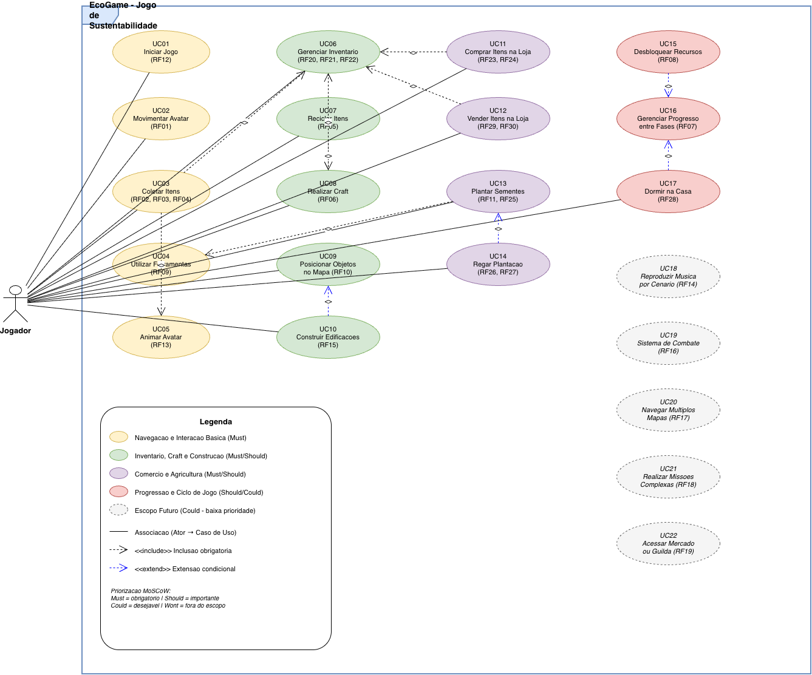
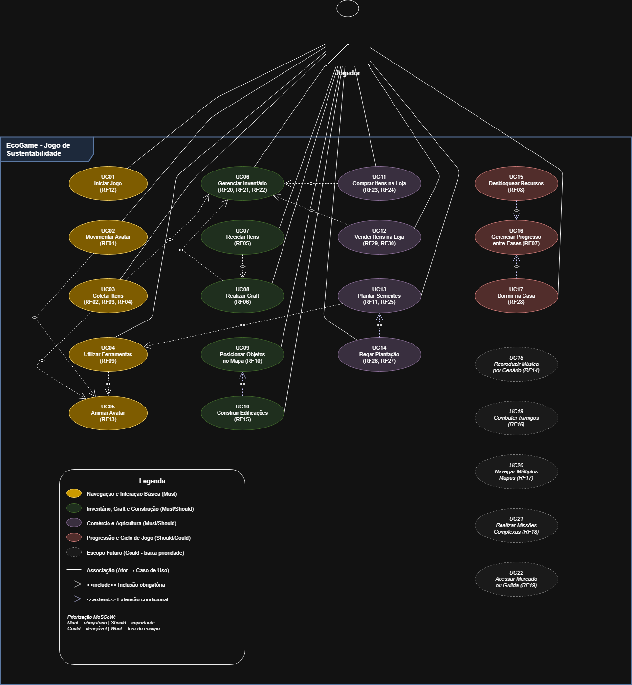

# 2.3. Modelagem Organizacional – Diagrama de Casos de Uso

## Introdução

Este artefato apresenta o Diagrama de Casos de Uso do projeto EcoGame, modelado segundo a notação UML. O diagrama foi construído a partir dos requisitos funcionais levantados durante o Design Sprint e priorizados com a técnica MoSCoW, conforme documentado na [Especificação de Requisitos](https://unbarqdsw2026-1-turma01.github.io/2026.1-T01_G1_FCTE_EcoGame_JogoSustentabilidade/desenho-de-software/base/iniciativas-extras/elicitacao/requisitos/).

O Diagrama de Casos de Uso tem como objetivo representar as funcionalidades do sistema sob a perspectiva do usuário (jogador), identificando os principais cenários de interação e seus relacionamentos.

## Metodologia

O diagrama foi elaborado com base nos 30 requisitos funcionais (RF01–RF30) e utiliza os seguintes elementos da notação UML:

-  **Ator**: representa o Jogador, único ator externo do sistema. 
-  **Casos de Uso**: representam as funcionalidades do sistema agrupadas por domínio.
-  **Relacionamento de Associação**: liga o ator aos casos de uso com os quais interage diretamente.
- **`<<include>>`**: indica que um caso de uso base obrigatoriamente invoca outro caso de uso.
- **`<<extend>>`**: indica que um caso de uso pode opcionalmente estender o comportamento de outro.

Os casos de uso foram organizados em cinco domínios com codificação por cores:

| Cor | Domínio | Prioridade |
|:----|:--------|:-----------|
| Amarelo | Navegação e Interação Básica | Must |
| Verde | Inventário, Craft e Construção | Must / Should |
| Roxo | Comércio e Agricultura | Must / Should |
| Vermelho | Progressão e Ciclo de Jogo | Should / Could |
| Cinza (tracejado) | Escopo Futuro | Could |

## Diagrama de Casos de Uso

O diagrama a seguir pode ser aberto e editado no [draw.io](https://app.diagrams.net/). O arquivo fonte está disponível em [`docs/imagens/diagrama-casos-de-uso.drawio`](../imagens/diagrama-casos-de-uso.drawio).

Figura 1: Versão 1.0 - Estrutura Base (Gabriel Bevilaqua)

Figura 2: Versão 2 – Refinamento Integral dos Diagramas e Formalização UML (João Pedro)

 Principais Modificações

- **Padronização Ortográfica e Acentuação**:  
  Correção de termos em português nos rótulos dos casos de uso:  
  `Inventario` → `Inventário`, `Edificacoes` → `Edificações`,  
  `Musica por Cenario` → `Música por Cenário`, `Multiplos Mapas` → `Múltiplos Mapas`,  
  `Missoes Complexas` → `Missões Complexas`.

- **Renomeação de Caso de Uso para Verbo no Infinitivo**:  
  `UC19 – Sistema de Combate (RF16)` foi alterado para **`UC19 – Combater Inimigos (RF16)`**, alinhando‑se à convenção de nomear casos de uso com verbos no infinitivo.

- **Adição de Relações de Inclusão (`<<include>>`) para a Animação do Avatar**:  
  - `UC02 (Movimentar Avatar)` passa a incluir `UC05 (Animar Avatar)`.  
  - `UC04 (Utilizar Ferramentas)` passa a incluir `UC05 (Animar Avatar)`.  
  Essas inclusões tornam explícito que a animação do avatar deve ser acionada obrigatoriamente sempre que o jogador se movimenta ou utiliza uma ferramenta.

## Tabela de Casos de Uso

| ID | Caso de Uso | Requisitos Relacionados | Prioridade | Descrição |
|:---|:------------|:------------------------|:-----------|:----------|
| UC01 | Iniciar Jogo | RF12 | Must | O jogador inicia o jogo pela tela inicial com opções "Iniciar" e "Sair". |
| UC02 | Movimentar Avatar | RF01 | Must | O jogador desloca o avatar 2D pelo mapa usando entradas WASD. |
| UC03 | Coletar Itens | RF02, RF03, RF04 | Must | O jogador coleta resíduos distribuídos no mapa, removendo-os do cenário e adicionando ao inventário. |
| UC04 | Utilizar Ferramentas | RF09 | Must | O jogador usa ferramentas (machado, picareta, pá) com animação própria. |
| UC05 | Animar Avatar | RF13 | Must | O sistema apresenta sprites distintos para os estados do avatar (andando, coletando, segurando objeto). |
| UC06 | Gerenciar Inventário | RF20, RF21, RF22 | Must | O jogador gerencia 24 espaços de inventário (8 barra fixa + 16 mochila), com acúmulo de até 12 unidades por espaço. |
| UC07 | Reciclar Itens | RF05 | Must | O jogador processa itens na maquininha de reciclagem, transformando materiais do inventário. |
| UC08 | Realizar Craft | RF06 | Must | O jogador cria novos itens a partir de combinações de materiais segundo receitas predefinidas. |
| UC09 | Posicionar Objetos no Mapa | RF10 | Must | O jogador posiciona itens decorativos ou funcionais em células habilitadas do grid do mapa. |
| UC10 | Construir Edificações | RF15 | Should | O jogador realiza construções simples como casa ou moinho. |
| UC11 | Comprar Itens na Loja | RF23, RF24 | Must | O jogador compra sementes e outros itens na loja do jogo. |
| UC12 | Vender Itens na Loja | RF29, RF30 | Must | O jogador vende plantas cultivadas e lixos na loja, recebendo dinheiro. |
| UC13 | Plantar Sementes | RF11, RF25 | Should | O jogador planta sementes em terreno arado usando o sistema de agricultura em grid. |
| UC14 | Regar Plantação | RF26, RF27 | Should | O jogador rega as plantações para que cresçam em 4 ciclos até a forma final. |
| UC15 | Desbloquear Recursos | RF08 | Must | O sistema desbloqueia novos itens, receitas e áreas do mapa conforme progressão. |
| UC16 | Gerenciar Progresso entre Fases | RF07 | Should | O sistema gerencia a transição entre as fases de limpeza, replantio e reconstrução. |
| UC17 | Dormir na Casa | RF28 | Could | Ao entrar na casa, um dia se passa, fazendo plantas crescerem e mais lixo aparecer. |
| UC18 | Reproduzir Música por Cenário | RF14 | Could | O sistema reproduz trilha/efeitos sonoros por cenário (escopo futuro). |
| UC19 | Sistema de Combate | RF16 | Could | Sistema de combate como incremento de escopo futuro. |
| UC20 | Navegar Múltiplos Mapas | RF17 | Could | Suporte a múltiplos mapas como expansão de escopo futuro. |
| UC21 | Realizar Missões Complexas | RF18 | Could | Missões complexas como incremento de escopo futuro. |
| UC22 | Acessar Mercado ou Guilda | RF19 | Could | Mercado ou guilda como funcionalidade extra de escopo futuro. |

## Relacionamentos

### `<<include>>` (Inclusão obrigatória)

| Caso de Uso Base | Caso de Uso Incluído | Justificativa |
|:-----------------|:---------------------|:--------------|
| UC03 - Coletar Itens | UC06 - Gerenciar Inventário | A coleta sempre adiciona o item ao inventário. |
| UC03 - Coletar Itens | UC05 - Animar Avatar | A coleta sempre aciona a animação correspondente (RF04, RF13). |
| UC08 - Realizar Craft | UC06 - Gerenciar Inventário | O craft sempre desconta materiais e adiciona o novo item ao inventário. |
| UC11 - Comprar Itens | UC06 - Gerenciar Inventário | A compra sempre adiciona itens ao inventário. |
| UC12 - Vender Itens | UC06 - Gerenciar Inventário | A venda sempre remove itens do inventário. |
| UC07 - Reciclar Itens | UC08 - Realizar Craft | A reciclagem alimenta o sistema de craft com materiais processados. |
| UC13 - Plantar Sementes | UC04 - Utilizar Ferramentas | O plantio requer uso de ferramentas para arar e plantar. |

### `<<extend>>` (Extensão condicional)

| Caso de Uso Extensor | Caso de Uso Base | Justificativa |
|:---------------------|:-----------------|:--------------|
| UC14 - Regar Plantação | UC13 - Plantar Sementes | O jogador pode opcionalmente regar após plantar para acelerar o crescimento. |
| UC10 - Construir Edificações | UC09 - Posicionar Objetos | Construir é uma forma específica de posicionar objetos no mapa. |
| UC15 - Desbloquear Recursos | UC16 - Gerenciar Progresso | O desbloqueio ocorre condicionalmente conforme o progresso do jogador. |
| UC17 - Dormir na Casa | UC16 - Gerenciar Progresso | Dormir avança o ciclo do jogo, afetando o progresso condicionalmente. |

---

## Outros Diagramas

A **Figura 2** apresenta o diagrama de casos de uso elaborado com base na proposta inicial de [Gabriel Bevilaqua](https://github.com/gabrielbevilaqua), adaptado e refinado para representar de forma mais consistente as interações entre os atores e o sistema. A imagem também pode ser acessada [AQUI](https://raw.githubusercontent.com/UnBArqDsw2026-1-Turma01/2026.1-T01-_G1_EcoGame-JogoSustentabilidade-_Entrega_02.-/refs/heads/main/docs/imagens/diagrama-casos-de-uso-matheus).

    
<strong>Figura 2 – Diagrama de Casos de Uso do Matheus</strong>

<iframe frameborder="0" style="width:100%;height:750px;" src=https://viewer.diagrams.net/?tags=%7B%7D&lightbox=1&highlight=0000ff&edit=_blank&layers=1&nav=1&title=diagrama-casos-de-uso-matheus.drawio&dark=0#R%3Cmxfile%3E%3Cdiagram%20name%3D%22Diagrama%20de%20Casos%20de%20Uso%22%20id%3D%22use-case-ecogame%22%3E7V1td5u4Ev41Pqf7ITmIdz46TtLd3ubebLNtt596ZJBtWoy8gBOnv%2F5KgBwQso1tCZs9Tk8aI0BgPc%2BMRjPDMDBG89X7BC5mDzhA0UDXgtXAuB3oOtBMQP7Qlteixda8omGahEF50FvDU%2FgLsTPL1mUYoLR2YIZxlIWLeqOP4xj5Wa0NJgl%2BqR82wVH9qgs4RY2GJx9GzdavYZDNylZb0952%2FI7C6YxdWmd75pAdXTakMxjgl0qTcTcwRgnGWfFpvhqhiI4eG5jivPsNe9d3lqA4a3OCbX58%2F58vjx9fP%2Fz%2B%2FVdwD26%2Bf7OuBL2UTWn2ygaB3PmCfkzyEb6ZZfOIbAHy8RklWUhGaxiF05i0ZXhBWic4zp7K0%2BlRL7MwQ08L6NOGF0IU0gbLM3xyXZSQhuKqzzBallcd6HZEL5cuYFy7H%2FufJR2z%2FDJXaU6ZITkAmItV3o%2BWoVV2VV6A7onQJMv3sDPJpyn9e%2Bfj93COyCFX5PcDnmJKVbr9tEwzcmdwHEZhAGlTcTNkeIv7KToob5qMAlpVRq8E4D3Cc5Qlr%2BSQWY0jbkmJlwql1o2sI7PcLiWHbcKS0dN152%2BYkw8l7HtQwCn6RUFDEpqcwMvER1v60hvcod0yLuAkm5ExjmF099Z6k%2BBlHKCg5MrbMR8xJVPe%2BANl2WupHOAyw3USolWY%2FV35%2FI181q4N7qfceUuHV2Mbr5WNR5SEZEQpGYu2mIzu39WNomOLbb51lW%2Bt%2B4qDIdU8ZDPGMSpa7kMKSr7fXybP%2BdfV1gTKYDJF2ZZx9cSsSlAEs%2FC5jpuIIOWpjzgkiK4ppjt1iumWVe%2BiuK%2FyLI5m69s4nHnAuFDv7KnnHkm9o3QTMC8MOXuGgA1z3n7aidwWfK0csKBaJ92svIBbV17MJLtvebwFLI6exR3I1XDWhb%2Fnz1%2Btj%2Fy1tS746174e%2F78dfrIX8fugL9s7X3h7znzV8rqpnP963TB34v9cEL%2B5qfyV26SOjY%2FxA%2Ffv%2FxcPkPo3a7cyc9P%2FpXRR067rtYBpy8Op%2FPXyfqx%2FD1q2a9fzM4eUMQ8JUUs%2B0KRs6eI2UvPkNnFytq6zII94G8vVyamvf14TzvueNsy1MuHrV%2Fk4%2Bzlwz6pkbiZD83UheU8GvoZTgbC9IWPcIyiR5yGWYhpUsIYZxmeDzblN%2BzOXfiApzAgVyva90sPsJvJAUY9NcDmIhlM%2FqUPsdlmiEk%2F4SKlhBLleVRGe0LINsIRBYGcZ0wmE933SXuaJfgnquwJ7LFN7Lsiw%2BMezsOIftPfUfSMKBrljlLwABABMIzDOSTjrw2fYUY%2FFOkb44Rlbrz7dA%2Bs3w4CyGkCBOw6Qi6XvKHbliqIZNoR1in1pKZIT4LT68ljV0qHmREmpydMc4cdwZ9gaB24g0yZa%2F0LgRW56PV%2BMtg0u1jKXRh8%2Fgw%2B0VLuaAZ3s9gCFwafPYOtnloRuiFXBwvDbTK9BRcCN%2BKg29ncJLAQo9M4g4%2FmL5CcKCgeG5mJKhcCqyHwafKsjiZwJ1F9azNdT%2B6NewrTDM3hQI03DliAA0hX5Y%2Bz2wzyWfrjvoTpkgD1K%2FfJZURg6FeNQz%2BEkdg3ZyrzzfFPvdiq0HJ7i9YDfiZKOM52eVA10BlK623pMHm9hYn0hgqM%2FiD6TYwQOYUMi0Y%2BGZ1hBZRhxTStGrACC7mBKQLL1ceGfRxYn5Af%2BhFDK07FcElUe04dJJOFIFjUSB1IrR4qPkuQRkm4Q54kxox2AGQqC%2BsBvbcAvUfklv0SpPiZ3v7IGAxBEmKxHeEW%2Bo%2FmmNO%2FuqYMP7JO5AAEygB0egvgCMek22VIAbwLwgk9jSLo0P9vLCTWi8BRBpvNTV6OoQw1pZaGUtToaswnq7Fc7v43%2FoEyLAAqpuUTHuCCGvdUV3qdgWYrq46wzQ9zPGgIENgcEWie7RjwONA%2Bj6gC4kEa4fkiqZohWkzx%2Boh%2FQKHo6boyFC2LEz1PGYpKZzzVKIImMF9QHKA9QJRo%2FO8A0VUHotFbEB8jWK6mnxBdWG%2Ba5tRZJ%2FwazXNVZSTpSrPGlML0CU1zkAq43uySobHBupTo%2F9iBF9CULQcMmQ8Zuk2kK7GH0vtegTclYpE1nfOsBS9QzI5i0OkCV%2FDaRxzAdLYOY0TUk3wD%2FZ%2FTPLzByFJe5i3kcVRerTDN1xpsC3RMIvySZyiWHm7ati4PRjd%2BLOcLNmYw8QfVgEURCAmqo5EPz9Z4xrb0znrNLTinAlgWu6puhbEf5XZ72TitHbIuh9UyPiJyJ7WvXOTodekw%2BKVWwdNG5aJGR667oyPFJZCMViu5qryUIZT5akor7l2nr%2Bk8ul6maARTdLfKHrMNKrURJhEq0KHdVLl34Na6c9pOa7m3cZsePUBfAr2pMNcF0ZgdovMKU5lj3yiVXFl0EI4ZTgLv5FbUKxAnKA1%2FlT1pA2FcjOm6eRgEecy2Ael2fceX5RNJf4uKey8lMLSynqkV6qYouUeZdjXHASp2lsRrlt1j16Hdbb5OpbKfVlb24zv6nIUspnSPkgTmMYu0XH26v1WK9hWXql%2F%2B0Fp%2BK46ULEJhXW8xqcTqh9VfLLu4Muod4MkkRWr0jidxzhfQeY9Jv5zimzH6Lif9ffO7WLLDNTDZVP%2BN25Y39QvSIlrO8GzJ1HKKR7ToZb6uPIM53vK4FYt24BwPDE5SPd7Fp3iSZzPVRdiOFDbNqAubbYNzErb97OmzEjb%2BgaWm9dRW2iw%2Bfa7Rk2pp62%2F4sZYl8%2BeSGM%2B14sN1l546X5HHufQMZaFiU6lfVnUgi%2FRaBPT%2FgnMYz%2FLi0dQN%2BxhGM%2Fo3ryS9OdgP1MVHPM57ZPFzpzwElTplO0NwBMktlcJWgPiA%2FVkYid3pwFUYRebrlCqLR5oyi%2BuynILWZknTyafSp3fteTZnddjOLrtDVP5LmOa81QhpaT2waauH3jiggx3qpr2pvktxqTYeZPrCz1sm6lZ4Wxu8Qvvttndb2uv9pT2w7TpZdetA2gOjTnuTD6Kqpr3MalrnTfvKenMv4l9b0qm%2Fn3PmrKiv89Q3D6W%2BzlHf6jgCYyrNyrp3R3ejkciAvXHJmGlHGbDDZxgXwZXchqXrjwzNF%2BJYta4uc%2FVtic%2FSsVjdcPll%2F5QmgKtFK3tb2xeBMRqpoKGyAG5YIOpl8qpRJq%2FanS35HXUIKnXPKEXwPSoS5z6hNBe722ApSoOkwqYOKQC8zqDSJVoFTM%2F%2Bu6wC2TYBE8M%2B2gRAq%2Be%2F2y5HzNY2gcZ5ox2d60mxTWDJfDHVv5L4QDrx%2B%2Bz%2B4B78sL1Did%2FQ7UbHxFdb8c%2F1kfhhSAmT8y1KxxH%2BZ4nKKdpfJumG2VlT9zQJAHz1E2Wed0tmCsf2JXtfK6TWddva4bWXv1dBJR%2Bjly%2FsWb%2FadtMJNh9D1iXXD9xcVaZ7jTWWspxYP8v4mOBpgtJUsHantKRRqXuYIpbbpnJ5wVcPkaC%2FNr8hpa%2BZr42nqOj6nH8o5wCE2mS66nrd3HBl1BsRQlRaA23yXLdBfElzPS7NtZYWUjzjRbWADnqY4WrWO5CS4SrkntQ3ZwlmlJ7l3GnXrlVf6bFU1T3dHEqebREYXk1bapuK6WPOneVxetx16l20XTaa%2FGu81OW3CjGQ%2Biqe7SuRnopapeEiaicQNZtzTXrWoaK2KyldsagpLfyh9NnavxIYpxPCPGrE3IYxsXqTDZFKdUWQXM6icfmwtTTTWeob7PY1Pzr2IGumV1d3ht5S2%2B3z0OwxqsvZS3Wdk3O5wdhD8%2FIdvgBAx5pLqrdyXyOha4GwzbpAOObOZNOLRBwoER7v%2FjhYItQ9qBKhKaHg9zFetZm%2F6471PRMg8h%2FRHK7lP2QPsQTLmdoVTdQHzb2m1px8DZdzLWo8cjJiI%2BXQZmFGhq%2FF4FIXDjeCbWwaY9D0LO2uPPwxv7nDKg8zL19VWrQdzlpPRsk5MqJqnepyaqJ60sjLEmi21HjWDG4BIaPgGB3oTCFnqxyN0CQTDdh%2F4TOa8iUatPzBJUrqxp6bot5iSq%2Bma%2B8elml2mLXOsKoNOj%2FqDjfqfDj8wFHXVdJb0jNLp6W3jCf%2B6ECfmt6NGqE0TkOrvIoYX9am5HflJCdf9mmGl1Egj%2B1gF9ttOWzvQ9m0k7IdaJIMEePUdB%2BRJQzlrZf4IWP1cJqE%2FjLKlglUSOadqpvPiTpwiE%2BUoLRXuP%2FEZJbxwCgd6VOTmeVEcEo69KP8SWu68QFPcw1dsJl8qVG3rCZLGjm0bvX6lINpbdF%2FIlrb%2BQ%2Fv9egBx2XU9qLDfmqO36U%2Bpg%2FsaPdLoqBzLo8KKmtX5HcMwxXV2gtiuyT54%2BldctuSw%2B19woMVsjdieJXxFzLv2IQ6QR46z7t1ivv%2BKe32rq6kepvsUxN7mKbYb5rZ74b0tU%2B6NrjTB6498OhZI5iuFfrnFHfJcM%2FczIk9GL7PO7iFDH%2BLW1dj1DWlfA7sN%2BSxn%2B9KKvudU7P%2FaF%2B69gc9qmL64HESTmG%2Bkr0x6Pq1MyEBuhwh2SciKkFIhP7v3DN%2BMvGx5YkP35VU8XHPWXza5ZVod6s8B3ctPz6Og%2BIVFlGHomPJEZ3vc0zsxBeFqLClLQtv6E2URGuOBnKPuaH6C%2FowfxcIfhrhr3l2K5%2FnUbghtPwsXrnRUwcO9dSxdV15XDhf4CSDcSYoiTaqHRmgFP0o3H7PKFr397VIxS2OmeDcIxLkK8vSDj%2BAGZYg8mXuWsCAA96SQDYTTBOD3ySbJsI%2F4ADRI%2F4P%3C%2Fdiagram%3E%3C%2Fmxfile%3E></iframe>

    
Autor: <a href="https://github.com/MatheusHenrickSantos">Matheus Henrick</a>.

---

## Especificação de Casos de Uso

    
<strong>Tabela 5 – Iniciar jogo</strong>

| **UC01** | **Informações** |
| -------- | --------------- |
| Descrição | O jogador é capaz de iniciar o jogo a partir da tela inicial, escolhendo entre as opções “Iniciar” ou “Sair”. |
| Ator | Jogador |
| Pré-condições | <ul><li> O jogador deve estar com o aplicativo/jogo aberto. </li><li> O sistema deve estar carregado até a tela inicial. </li></ul> |
| Ação | O jogador seleciona a opção “Iniciar” para começar a partida. |
| Fluxo principal | <ul><li> O jogador acessa a tela inicial do jogo. <ul><li> O sistema exibe as opções “Iniciar” e “Sair”. <ul><li> O jogador seleciona “Iniciar”. <ul><li> O sistema carrega o ambiente inicial do jogo e posiciona o avatar na primeira fase. </li></ul> </li></ul> </li></ul> </li></ul> |
| Fluxo alternativo | <ul><li> O jogador acessa a tela inicial do jogo. <ul><li> O sistema exibe as opções “Iniciar” e “Sair”. <ul><li> O jogador seleciona “Sair”. <ul><li> O sistema encerra a aplicação. </li></ul> </li></ul> </li></ul> </li></ul> |
| Fluxo de exceção | <ul><li> O jogador seleciona “Iniciar”. <ul><li> O sistema não consegue carregar os recursos iniciais devido a falha técnica. <ul><li> O sistema exibe uma mensagem informando que não foi possível iniciar o jogo e retorna à tela inicial. </li></ul> </li></ul> </li></ul> |
| Pós-condições | <ul><li> O jogo é iniciado e o avatar do jogador é posicionado na primeira fase. </li><li> Caso o jogador selecione “Sair”, o sistema é encerrado. </li></ul> |
| Data de Criação | 16/04/2026 |
| Rastreabilidade | [RF12]() |

    
Autor: <a href="https://github.com/MatheusHenrickSantos">Matheus Henrick</a>.

---

## Figura 4: Versão 4.0 — Refinamento Técnico e Integração com Diagrama de Classes

Nesta versão, o diagrama foi refinado a partir das versões anteriores para garantir a consistência com a modelagem estrutural (Diagrama de Classes) e para formalizar fluxos de exceção através de pontos de extensão detalhados.

    
Autor: <a href="https://github.com/yaabdon">Yasmin Abdon</a>.

### Detalhamento Técnico das Evoluções (V3)

Para elevar o rigor técnico do artefato, foram implementadas as seguintes melhorias:

* **Formalização de Pontos de Extensão (`extension points`)**: Foram adicionados compartimentos técnicos dentro das elipses para mapear os "ganchos" lógicos de extensão.
* **Notas de Condição de Negócio**: Inclusão de balões de anotação UML que definem as condições exatas (ex: `{energia == 0}`, `{moeda < preco}`) baseadas nos atributos das classes já modeladas.
* **Mapeamento de Operações**: As elipses agora contêm as operações (métodos) correspondentes, garantindo que cada Caso de Uso tenha uma representação funcional no Diagrama de Classes.
* **Correção de Dependência de Extensão**: Ajuste na direção das flechas de `<<extend>>` para apontar corretamente para os Casos de Uso base (ex: Exaustão -> Dormir).

### Tabela de Extensões Técnicas Adicionais

| Caso de Uso Base | Ponto de Extensão | Caso de Uso Extensor | Condição de Ativação |
| :--- | :--- | :--- | :--- |
| Movimentar Avatar | Checar Estamina | **Notificar Exaustão** | `{jogador.energia <= 0}` |
| Realizar Comércio | Verificar Saldo | **Saldo Insuficiente** | `{jogador.moeda < item.precoCompra}` |
| Gerenciar Inventário | Verificar Capacidade | **Inventário Cheio** | `{inventario.estaCheio == true}` |
| Dormir/Avançar Dia | (Base) | **Notificar Exaustão** | `{jogador.energia == 0}` |

    
Autor: <a href="https://github.com/yaabdon">Yasmin Abdon</a>.

## Referências

- BOOCH, Grady; RUMBAUGH, James; JACOBSON, Ivar. **UML: Guia do Usuário**. 2ª ed. Rio de Janeiro: Elsevier, 2005.
- PRESSMAN, Roger S.; MAXIM, Bruce R. **Engenharia de Software: Uma Abordagem Profissional**. 9ª ed. Porto Alegre: AMGH, 2021.
- Especificação de Requisitos e Priorização do projeto EcoGame.
- Casos de Uso. Repositório do Grupo MeuSUSDigital da disciplina de Requisitos de Software da Universidade de Brasília, 2024. Disponível em: [https://github.com/Requisitos-de-Software/2024.2-MeuSUSDigital](https://github.com/Requisitos-de-Software/2024.2-MeuSUSDigital/blob/main/docs/modelagem/caso-de-uso.md). Acesso em: 16 abr. 2026.

<!-- O Histórico de Versão tem que ser removido porque a professora não gostou
## Histórico de Versão

| Versão | Data       | Descrição                          | Autor | Revisor |
|:------:|:----------:|:----------------------------------:|:-----:|:-------:|
| 1.0    | 15/04/2026 | Criação do diagrama de casos de uso | [Gabriel Bevilaqua](https://github.com/gabrielbevilaqua) |  |
-->