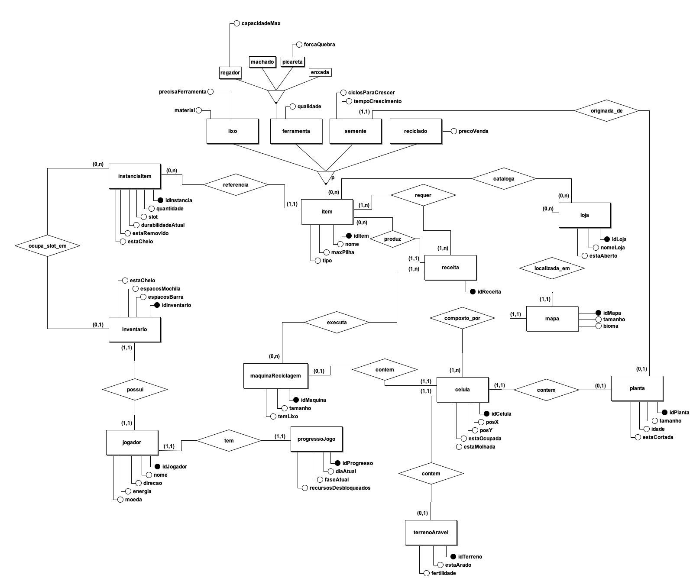

## Modelagem de Banco de Dados (Iniciativa Extra)

## Introdução

Este artefato apresenta o Modelo Conceitual de Banco de Dados do projeto EcoGame, elaborado seguindo a notação de Peter Chen para Diagramas Entidade-Relacionamento (ER). O modelo foi construído a partir do Diagrama de Classes (seção 2.1) e dos requisitos funcionais RF01-RF30, com foco na persistência do estado do jogo entre sessões.

O Modelo Conceitual tem como objetivo representar as entidades do domínio, seus atributos e os relacionamentos entre elas, de forma independente de tecnologia de banco de dados, servindo como base para a derivação do modelo lógico e físico nas etapas seguintes.

## Metodologia

O modelo foi elaborado com a ferramenta brModelo 3, utilizando os seguintes elementos de notação ER:

- **Entidade**: Representada por um retângulo. Define um conjunto de objetos do domínio com existência independente.
- **Atributo**: Representado por uma elipse conectada à entidade. Atributos identificadores (chave primária) são representados com elipse preenchida.
- **Relacionamento**: Representado por um losango conectando duas ou mais entidades, com cardinalidades mínima e máxima indicadas no formato (min, max).
- **Especialização**: Representada por um triângulo conectando uma entidade genérica a suas especializações. Classificada como parcial (p) — nem toda instância da entidade genérica precisa pertencer a um subtipo — e não exclusiva — uma instância pode pertencer a mais de um subtipo simultaneamente.

Uma decisão de design central deste modelo é a separação entre **ITEM** (catálogo imutável de itens do jogo) e **INSTANCIA_ITEM** (o item concreto em posse de um jogador), garantindo integridade referencial e correta persistência do estado individual de cada item durante o salvamento e carregamento de partidas (RF28).

## Modelo Conceitual

**Imagem 1 - Modelo Conceitual de Banco de Dados V1**

**Autor - José Oliveira**

Principais decisões de modelagem:

- **Atributos de estado em INSTANCIA_ITEM (decisão v1)**: Atributos como
  `durabilidadeAtual`, `estaCheio` e `estaRemovido` foram consolidados em
  INSTANCIA_ITEM por simplicidade. Em versões futuras, pretende-se especializar
  INSTANCIA_ITEM nos subtipos INSTANCIA_FERRAMENTA, INSTANCIA_REGADOR e
  INSTANCIA_LIXO, eliminando atributos nulos e atingindo conformidade com BCNF.

- **Separação ITEM / INSTANCIA_ITEM**: O catálogo de itens (ITEM e suas especializações) armazena apenas atributos fixos e imutáveis. Estados que mudam durante o jogo (durabilidade, estaCheio, estaRemovido) ficam em INSTANCIA_ITEM, evitando corrupção do catálogo ao salvar.

- **Especialização parcial e não exclusiva de ITEM**: As especializações LIXO, FERRAMENTA, SEMENTE e RECICLADO foram modeladas como parciais e não exclusivas, pois um item reciclado pode também ser uma ferramenta, refletindo a mecânica de craft do jogo (RF05, RF06).

- **Especialização exclusiva de FERRAMENTA**: As subclasses MACHADO, REGADOR, ENXADA e PICARETA são exclusivas entre si — uma ferramenta não pode ser simultaneamente dois tipos distintos.

- **CELULA como unidade de persistência do mapa**: Cada célula do mapa é persistida individualmente com seus estados (estaOcupada, estaMolhada), permitindo que o estado exato do mapa seja restaurado ao carregar uma partida (RF28).

- **RECEITA como entidade associativa N:M**: O relacionamento entre ITEM (ingredientes) e RECEITA foi modelado como N:M, pois uma receita pode exigir múltiplos tipos de item e um mesmo item pode ser ingrediente em várias receitas (RF06).