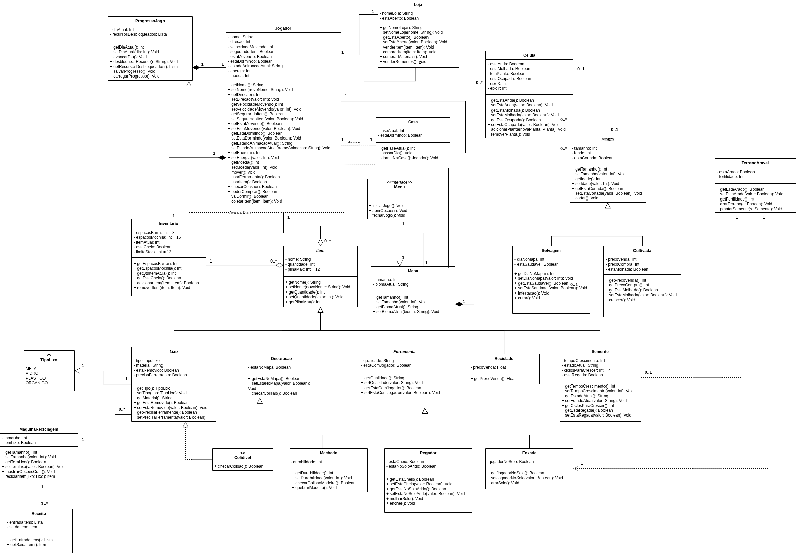

#  EcoGame

Esse repositório é para ser utilizado pelos grupos como um template inicial.
As seções do Template NÃO DEVEM SER OMITIDAS, sendo TODAS RELEVANTES.
Demais diretrizes constam no Moodle.

# Nome do Projeto

**Código da Disciplina**: FGA0208 
**Número do Grupo**: 01 
**Entrega**: 02 

## Alunos
|Matrícula | Aluno |
| -- | -- |
| 22/1022480 |  Carlos Henrique de Paiva Munis |
| 21/1062910  |  Daniel Nunes Duarte  |
| 23/1038072  |  Gabriel Dantas Bevilaqua Mendes |
| 22/2024837  |  Guilherme Costa Zanella  |
| 23/2002996  |  Heyttor augusto de assis silva |
| 23/2003661  |  João Pedro Araújo de Freitas Lyra  |
| 22/1008211  |  José Felipe Duarte Guedes de Oliveira |
| 19/0018101  |  Matheus Henrick Dutra dos Santos |
| 22/1008436  |  Ryan Augusto Brandão Salles |
| 23/2014271  |  Yasmin Sousa Abdon |

## Sobre

Este artefato documenta a modelagem do sistema **EcoGame**, fundamentada nos requisitos funcionais estabelecidos na [Entrega 01](https://unbarqdsw2026-1-turma01.github.io/2026.1-T01_G1_FCTE_EcoGame_JogoSustentabilidade/desenho-de-software/base/iniciativas-extras/elicitacao/requisitos/). O projeto utiliza a notação **UML** como linguagem padronizada, com suporte técnico da documentação oficial [uml-diagrams.org](https://www.uml-diagrams.org/).

### Metodologia de Modelagem e Workflow

Diferente de uma abordagem rígida, o grupo optou por um fluxo de **exploração de rotas**. Cada frente de modelagem (estática e dinâmica) serviu como um laboratório para discutir a viabilidade da implementação futura.

* **Autonomia e Iteração:** Cada integrante teve liberdade para propor diagramas base e versões subsequentes. Esse processo permitiu que diferentes visões da arquitetura fossem confrontadas antes da decisão final de implementação.
* **Responsabilidade de Evolução:** Estabeleceu-se que a responsabilidade pela integridade do artefato recai sobre o **último fluxo de trabalho (workflow)** aplicado. Ou seja, quem realiza as iterações finais deve garantir que a modelagem esteja condizente com o nível de maturidade exigido pelo projeto e pronta para guiar o desenvolvimento do código.
* **Centralização de Ferramenta:** Todas as versões foram padronizadas via [draw.io](https://app.diagrams.net/).

### Frentes de Exploração Inicial

Abaixo, os responsáveis por iniciar as discussões e as bases conceituais de cada modelo:

| Integrante | Frente de Modelagem | Referência Técnica |
| :--- | :--- | :--- |
| **Heyttor** | Diagrama de Classes (Estática) | [Class Diagram](https://www.uml-diagrams.org/class-diagrams-overview.html) |
| **Ryan** | Máquina de Estados (Dinâmica) | [State Machine Diagram](https://www.uml-diagrams.org/state-machine-diagrams.html) |
| **Gabriel** | Casos de Uso | [Use Case Diagram](https://www.uml-diagrams.org/use-case-diagrams.html) |

---
> **Atenção:** Como o grupo prioriza a evolução constante, os diagramas mais atualizados e que melhor refletem a estrutura a ser codificada estão posicionados ao final de cada respectiva página.

## Screenshots da Segunda Entrega

## Há algo a ser executado?

( ) SIM

(X) NÃO

Se SIM, insira um manual (ou um script) para auxiliar ainda mais os interessados na execução.

## Informações Complementares 
Quaisquer outras informações adicionais podem ser descritas nessa seção.
